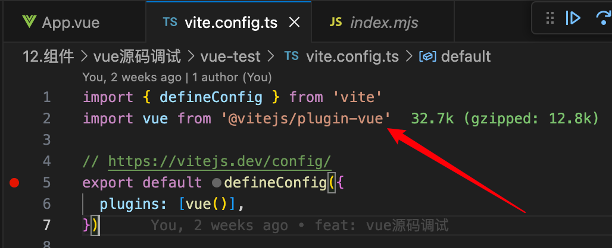
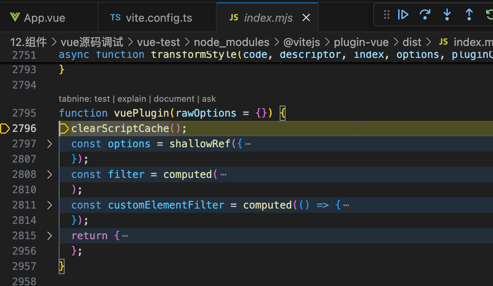
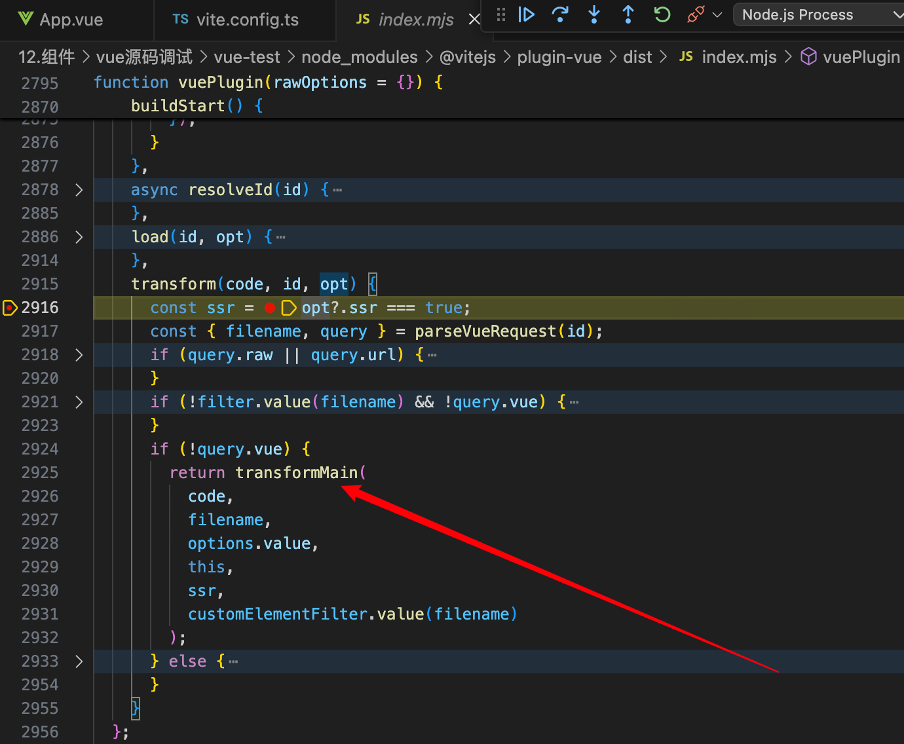
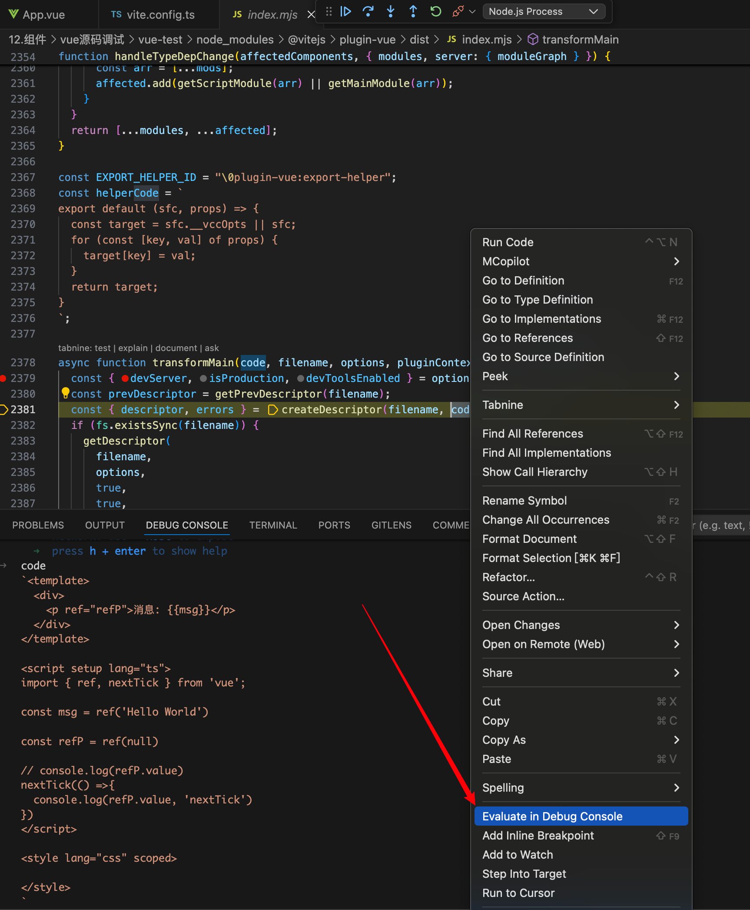
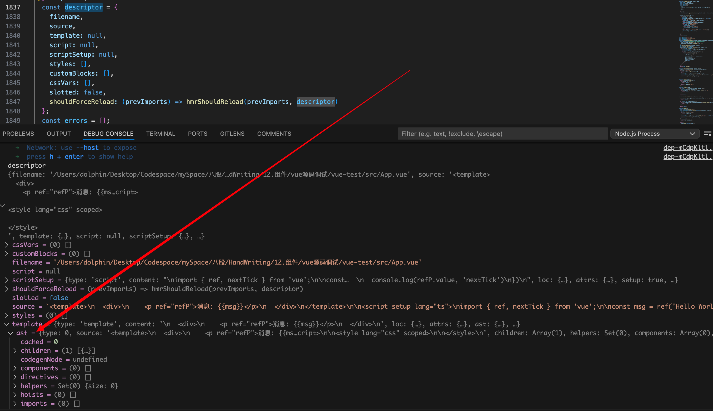
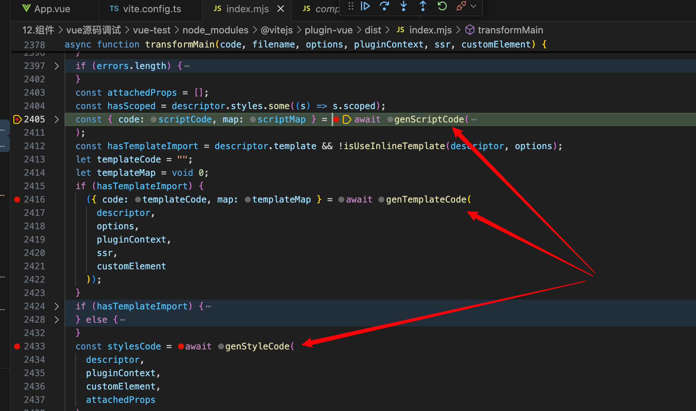
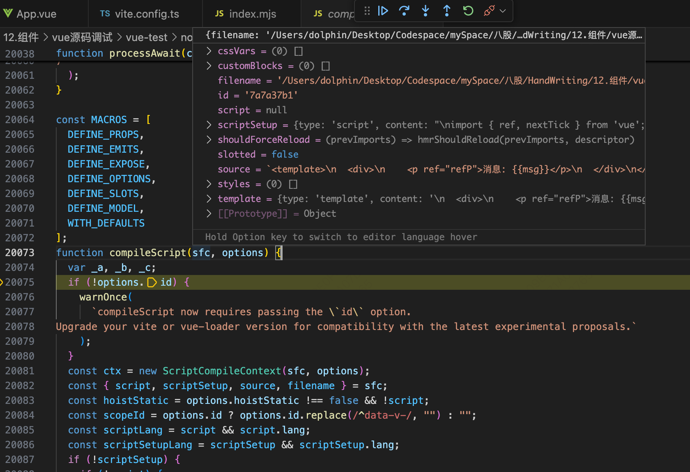
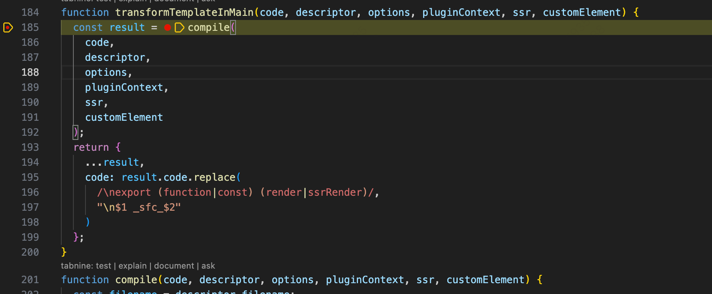
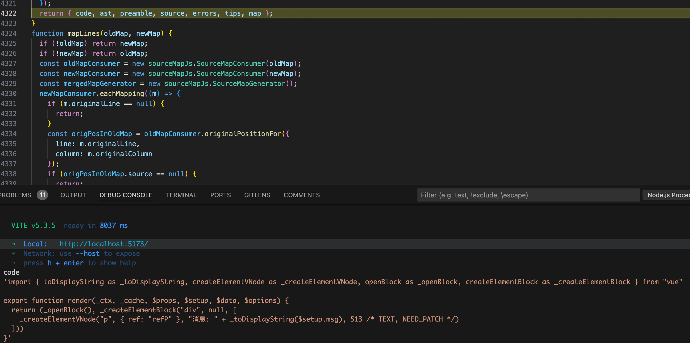
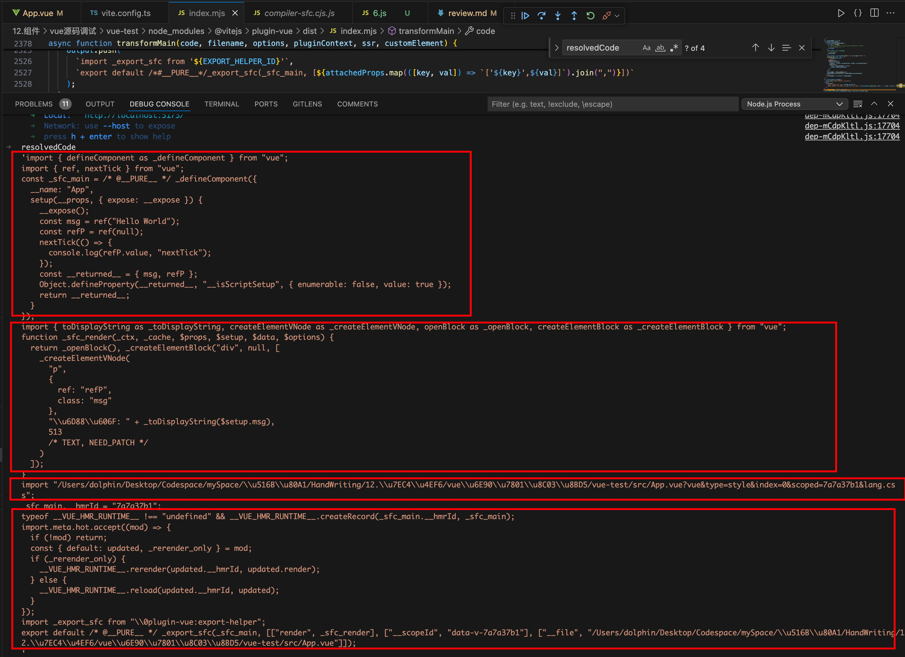

# 源码调试观察 vue 如何被编译的：

1. 浏览器不认识 vue 文件，如何转成“三把斧”：vite.config.ts 中有个导入 @vitejs/plugin-vue，看到 plugin 插件应该就可以猜出大概源头在此处，他负责转换 vue 文件，对这里打上一个断点，vscode 开一个 debug 版终端执行 run dev


2. 于是进入 vuePlugin 函数


这个函数中的 return 有好几个 vite 中的钩子：config，buildStart，laod，transform……

其中 buildStart 函数如下

```js
buildStart() {
    const compiler = options.value.compiler = options.value.compiler || resolveCompiler(options.value.root);
    if (compiler.invalidateTypeCache) {
    options.value.devServer?.watcher.on("unlink", (file) => {
        compiler.invalidateTypeCache(file);
    });
    }
}
```

会创建一个 compiler 对象，其中靠的是 resolveCompiler ，这个函数如下

```js
function resolveCompiler(root) {
  const compiler = tryResolveCompiler(root) || tryResolveCompiler();
  if (!compiler) {
    throw new Error(
      `Failed to resolve vue/compiler-sfc.
@vitejs/plugin-vue requires vue (>=3.2.25) to be present in the dependency tree.`
    );
  }
  return compiler;
}
function tryResolveCompiler(root) {
  const vueMeta = tryRequire("vue/package.json", root);
  if (vueMeta && vueMeta.version.split(".")[0] >= 3) {
    return tryRequire("vue/compiler-sfc", root);
  }
}
```

不难看出会进行判断 vue  的版本，最终得到的 compiler 就是 tryRequire("vue/compiler-sfc", root); 因此著名的 compiler 是通过另一个名为 vue/compiler-sfc 的库生成的

继续对这 transform 打上一个断点，只有打开本地页面才能走到此处的逻辑

 

transform 函数主要是靠 tramsformMain 这个函数发挥作用，cmd + click 进入这个函数打上一个断点，进入此函数，里面有个 createDescriptor 函数，形参有个 code，选中右键可以将其打印在 console


这个函数已经开始准备将整个 App.vue 的代码进行转化了，直接看到 createDescriptor 函数

```js
function createDescriptor(filename, source, { root, isProduction, sourceMap, compiler, template }, hmr = false) {
  const { descriptor, errors } = compiler.parse(source, {
    filename,
    sourceMap,
    templateParseOptions: template?.compilerOptions
  });
  const normalizedPath = normalizePath$1(path.relative(root, filename));
  descriptor.id = getHash(normalizedPath + (isProduction ? source : ""));
  (hmr ? hmrCache : cache).set(filename, descriptor);
  return { descriptor, errors };
}
```

compiler 此处出现了，是从 createDescriptor 第三个参数解构出来的，这个形参应该就是 options，而这个 compiler 在 buildStart 中被赋值时就存入到了 opitons.value 中，至于 compiler 身上的 parse 方法哪里来的，肯定是从 vue/compiler-sfc 获取的

4. compiler 身上的 parse 方法接受两个参数，一个是 App.vue 的 代码字符串，另一个是 options，调试进入这个函数，返回值有两个，一个是 descriptor，另一个是 error，descriptor 如下

```js
const descriptor = {
    filename,
    source,
    template: null,
    script: null,
    scriptSetup: null,
    styles: [],
    customBlocks: [],
    cssVars: [],
    slotted: false,
    shouldForceReload: (prevImports) => hmrShouldReload(prevImports, descriptor)
  };
```

逻辑走到最后去打印这个值，可以看到 template 和 ast


parse 函数将 App.vue 代码的 template 部分单独抽离出来并整合成了一个 ast 抽象语法树

```json
filename: '/Users/dolphin/Desktop/Codespace/mySpace/八股/HandWriting/12.组件/vue源码调试/vue-test/src/App.vue'
script: null
scriptSetup: {type: 'script', content: "\nimport { ref, nextTick } from 'vue';\n\nconst…  \n  console.log(refP.value, 'nextTick')\n})\n", loc: {…}, attrs: {…}, setup: true, …}
shouldForceReload: (prevImports) => hmrShouldReload(prevImports, descriptor)
slotted: false
source: `<template>\n  <div>\n    <p ref="refP">消息: {{msg}}</p>\n  </div>\n</template>\n\n<script setup lang="ts">\nimport { ref, nextTick } from 'vue';\n\nconst msg = ref('Hello World')\n\nconst refP = ref(null)\n\n// console.log(refP.value)\nnextTick(() =>{  \n  console.log(refP.value, 'nextTick')\n})\n</script>\n\n<style lang="css" scoped>\n\n</style>\n`
styles: (0) []
template: {type: 'template', content: '\n  <div>\n    <p ref="refP">消息: {{msg}}</p>\n  </div>\n', loc: {…}, attrs: {…}, ast: {…}, …}
ast: {type: 0, source: '<template>\n  <div>\n    <p ref="refP">消息: {{ms…cript>\n\n<style lang="css" scoped>\n\n</style>\n', children: Array(1), helpers: Set(0), components: Array(0), …}
attrs: {}
content: '\n  <div>\n    <p ref="refP">消息: {{msg}}</p>\n  </div>\n'
loc: {start: {…}, end: {…}, source: '\n  <div>\n    <p ref="refP">消息: {{msg}}</p>\n  </div>\n'}
map: {version: 3, sources: Array(1), names: Array(0), mappings: ';EACE,CAAC,CAAC,CAAC,CAAC;IACF,CAAC,EAAE,CAA…AC,CAAC,CAAC;EAC9B,CAAC,CAAC,CAAC,CAAC,CAAC', file: '/Users/dolphin/Desktop/Codespace/mySpace/八股/HandWriting/12.组件/vue源码调试/vue-test/src/App.vue', …}
type: 'template'
[[Prototype]]: Object
[[Prototype]]: Object
```

里面还有 script 和 scriptSetup ，这里我写了 setup 版的 script，因此收集到了这里，style 用了数组装是因为可以多个 style

5. 前面是 createDescriptor 函数帮忙把整个 App.vue 的代码进行了拆分成了三部分，现在回到 transformMain 函数，后面的逻辑交给 genScriptCode ，genTemplateCode 和 genStylesCode

6. 进入 genScriptCode

```js
async function genScriptCode(descriptor, options, pluginContext, ssr, customElement) {
  let scriptCode = `const ${scriptIdentifier} = {}`;
  let map;
  const script = resolveScript(descriptor, options, ssr, customElement);
  if (script) {
    if (canInlineMain(descriptor, options)) {
      if (!options.compiler.version) {
        const userPlugins = options.script?.babelParserPlugins || [];
        const defaultPlugins = script.lang === "ts" ? userPlugins.includes("decorators") ? ["typescript"] : ["typescript", "decorators-legacy"] : [];
        scriptCode = options.compiler.rewriteDefault(
          script.content,
          scriptIdentifier,
          [...defaultPlugins, ...userPlugins]
        );
      } else {
        scriptCode = script.content;
      }
      map = script.map;
    } else {
      if (script.src) {
        await linkSrcToDescriptor(script.src, descriptor, pluginContext, false);
      }
      const src = script.src || descriptor.filename;
      const langFallback = script.src && path.extname(src).slice(1) || "js";
      const attrsQuery = attrsToQuery(script.attrs, langFallback);
      const srcQuery = script.src ? `&src=true` : ``;
      const query = `?vue&type=script${srcQuery}${attrsQuery}`;
      const request = JSON.stringify(src + query);
      scriptCode = `import _sfc_main from ${request}
export * from ${request}`;
    }
  }
  return {
    code: scriptCode,
    map
  };
}
```

其实这个解析主要是靠 resolveScript 函数，这个函数如下

```js
function resolveScript(descriptor, options, ssr, customElement) {
  if (!descriptor.script && !descriptor.scriptSetup) {
    return null;
  }
  const cached = getResolvedScript(descriptor, ssr);
  if (cached) {
    return cached;
  }
  let resolved = null;
  resolved = options.compiler.compileScript(descriptor, {
    ...options.script,
    id: descriptor.id,
    isProd: options.isProduction,
    inlineTemplate: isUseInlineTemplate(descriptor, options),
    templateOptions: resolveTemplateCompilerOptions(descriptor, options, ssr),
    sourceMap: options.sourceMap,
    genDefaultAs: canInlineMain(descriptor, options) ? scriptIdentifier : void 0,
    customElement,
    propsDestructure: options.features?.propsDestructure ?? options.script?.propsDestructure
  });
  if (!options.isProduction && resolved?.deps) {
    for (const [key, sfcs] of typeDepToSFCMap) {
      if (sfcs.has(descriptor.filename) && !resolved.deps.includes(key)) {
        sfcs.delete(descriptor.filename);
      }
    }
    for (const dep of resolved.deps) {
      const existingSet = typeDepToSFCMap.get(dep);
      if (!existingSet) {
        typeDepToSFCMap.set(dep, /* @__PURE__ */ new Set([descriptor.filename]));
      } else {
        existingSet.add(descriptor.filename);
      }
    }
  }
  setResolvedScript(descriptor, resolved, ssr);
  return resolved;
}
```

其实就是靠 compiler 身上的 compileScript 方法，解析成 resolved，给到 scriptCode，compiler 身上的方法肯定都是 那个引入的底层库拿到的，现在进入这个函数来看看：


这个函数有 700+ 行代码，入参 sfc 其实就是 之前的 descriptor，options 还是之前的，直接看到 它的返回值

```js
  return {
    ...scriptSetup,
    bindings: ctx.bindingMetadata,
    imports: ctx.userImports,
    content: ctx.s.toString(),
    map: options.sourceMap !== false ? ctx.s.generateMap({
      source: filename,
      hires: true,
      includeContent: true
    }) : void 0,
    scriptAst: scriptAst == null ? void 0 : scriptAst.body,
    scriptSetupAst: scriptSetupAst == null ? void 0 : scriptSetupAst.body,
    deps: ctx.deps ? [...ctx.deps] : void 0
  };
  ```

有 scritpAst，scriptSetupAst，看样子这个 compiler.compileScript 函数将 script 部分也转换成了 ast，直接看最后的 resolved

```json
attrs: {setup: true, lang: 'ts'}
bindings: {ref: 'setup-const', nextTick: 'setup-const', msg: 'setup-ref', refP: 'setup-ref'}
content: "import { defineComponent as _defineComponent } from 'vue'\nimport { ref, nextTick } from 'vue';\n\n\nconst _sfc_main = /*#__PURE__*/_defineComponent({\n  __name: 'App',\n  setup(__props, { expose: __expose }) {\n  __expose();\n\nconst msg = ref('Hello World')\n\nconst refP = ref(null)\n\n// console.log(refP.value)\nnextTick(() =>{  \n  console.log(refP.value, 'nextTick')\n})\n\nconst __returned__ = { msg, refP }\nObject.defineProperty(__returned__, '__isScriptSetup', { enumerable: false, value: true })\nreturn __returned__\n}\n\n})"
deps: undefined
imports: {ref: {…}, nextTick: {…}}
lang: 'ts'
loc: {start: {…}, end: {…}, source: "\nimport { ref, nextTick } from 'vue';\n\nconst …  \n  console.log(refP.value, 'nextTick')\n})\n"}
map: SourceMap {version: 3, file: undefined, sources: Array(1), sourcesContent: Array(1), names: Array(0), …}
scriptAst: undefined
scriptSetupAst: (4) [Node, Node, Node, Node]
setup: true
type: 'script'
[[Prototype]]: Object
```

content 其实就是最终给浏览器的 js 代码，回到 genScriptCode，发现最后的 code 就是这里的 content 代码。因此可以总结出 genScriptCode 函数的作用就是将 createDescriptor 分解出的 script 部分代码通过内部函数 compiler.compileScript 讲起转成了 scritpSetupAst 和 content，content 就是最后的产物，这个浏览器可以直接读懂

6. 来到 genTemplateCode：

```js
async function genTemplateCode(descriptor, options, pluginContext, ssr, customElement) {
  const template = descriptor.template;
  const hasScoped = descriptor.styles.some((style) => style.scoped);
  if ((!template.lang || template.lang === "html") && !template.src) {
    return transformTemplateInMain(
      template.content,
      descriptor,
      options,
      pluginContext,
      ssr,
      customElement
    );
  } else {
    if (template.src) {
      await linkSrcToDescriptor(
        template.src,
        descriptor,
        pluginContext,
        hasScoped
      );
    }
    const src = template.src || descriptor.filename;
    const srcQuery = template.src ? hasScoped ? `&src=${descriptor.id}` : "&src=true" : "";
    const scopedQuery = hasScoped ? `&scoped=${descriptor.id}` : ``;
    const attrsQuery = attrsToQuery(template.attrs, "js", true);
    const query = `?vue&type=template${srcQuery}${scopedQuery}${attrsQuery}`;
    const request = JSON.stringify(src + query);
    const renderFnName = ssr ? "ssrRender" : "render";
    return {
      code: `import { ${renderFnName} as _sfc_${renderFnName} } from ${request}`,
      map: void 0
    };
  }
}
```

会进入函数 transformTemplateInMain 


靠的里面的 compile 函数，这个函数里面又有个 options.compiler.compileTemplate，又是 compiler 身上的方法，之前的 compileScript 第一个入参就是 descriptor，这里面又借助了函数 resolveTemplateCompilerOptions，入参为 descriptor 和 options，进入 compileScript，这个底层 api 又借助了另一个 函数 doCompileTemplate，最后会返回一个 code


code 应该就是 template 转化后的最终产物，这个代码浏览器应该可以直接 进行 render。

7. 来到 genStyleCode：这个函数内部对样式数组长度进行判断，这里 App.vue 样式没有写任何内容，因此就是空值，于是重新写了点样式，发现产物 styleCodes 如下


```json
import "/Users/dolphin/Desktop/Codespace/mySpace/八股/HandWriting/12.组件/vue源码调试/vue-test/src/App.vue?vue&type=style&index=0&scoped=7a7a37b1&lang.css"'
```


是个 import 语句，导入的是 App.vue 文件，还有几个参数：vue，type，index，scoped 和 lang。看到导入就会记起 transform 这个 vite 钩子，这个钩子的执行时机是导入模块，此时正是导入 vue，type……模块，因此会进入 transform 函数中


当 query.vue 存在并且 query.type 为 style 时 ，走入 函数 transformStyle 中：

```js
async function transformStyle(code, descriptor, index, options, pluginContext, filename) {
  const block = descriptor.styles[index];
  const result = await options.compiler.compileStyleAsync({
    ...options.style,
    filename: descriptor.filename,
    id: `data-v-${descriptor.id}`,
    isProd: options.isProduction,
    source: code,
    scoped: block.scoped,
    ...options.cssDevSourcemap ? {
      postcssOptions: {
        map: {
          from: filename,
          inline: false,
          annotation: false
        }
      }
    } : {}
  });
  if (result.errors.length) {
    result.errors.forEach((error) => {
      if (error.line && error.column) {
        error.loc = {
          file: descriptor.filename,
          line: error.line + block.loc.start.line,
          column: error.column
        };
      }
      pluginContext.error(error);
    });
    return null;
  }
  const map = result.map ? await formatPostcssSourceMap(
    // version property of result.map is declared as string
    // but actually it is a number
    result.map,
    filename
  ) : { mappings: "" };
  return {
    code: result.code,
    map
  };
}
```

熟悉的实现方式，借助 compiler 身上的 compileStyleAsync 函数，函数执行这里带过，方式和前面保持一致，返回值如下

```json
code: '\n.msg[data-v-7a7a37b1] {\n  color: red;\n}\n'
dependencies: Set(0) {size: 0}
errors: (0) []
map: undefined
modules: undefined
rawResult: 
.msg[data-v-7a7a37b1] {
  color: red;
}
[[Prototype]]: Object
```

code 里面应该就是最终需要的产物

8. 最终跳出 genScirptCode，genTemplateCode，genStyleCode 函数，来到 transformMain 中俯看全流程就清晰了，这个函数就是将整个 vue 文件进行编译。在执行这个函数之前会由 createDescriptor 产出一个 descriptor 对象，这个对象会作为 入参 供 compiler 身上的方法使用，因为这个对象刚好将 App.vue 拆成了三部分，分别会有 genScriptCode，genTemplateCode，genStyleCode 对其解析成 ast，而 style 最终是个 导入 模块再次执行 transform 钩子，最终 解析出的代码分别有 四部分


前三部分分别对应着 scirpt，template，styles

## 总得来看
 vue 文件被解析的全流程：vite 有个钩子 transform，只要有导入就会触发这个钩子的执行，因此断点到 import vue 就可以看到 transform 的执行，这个函数内部有个 transformMain ，里面有四个函数 createDescriptor，genScriptCode，genTemplateCode 和 genStyleCode，createDescriptor 将 App.vue 拆分三部分汇入到 对象 descriptor 中，于是后面三个函数分别将其解析成 浏览器读懂的 代码，分别是 genScriptCode 有个 compiler.compileScript 将 descriptor 的 scriptSetup 部分拿到得到 ast，genTemplateCode 有个 compiler.compileTemplate 转换成 可渲染的函数，genStyleCode 有个 compileStyleAsync 转换成 import 语句，最后三部分 join('/n')起来，得到上面的代码