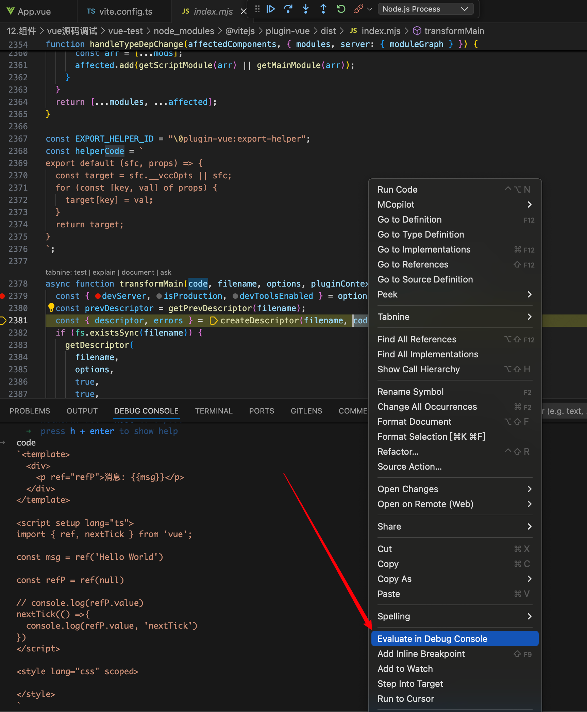
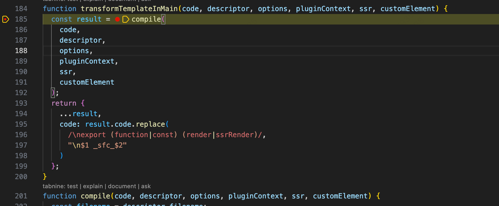

# 源码调试观察 vue 如何被编译的：

1. 浏览器不认识 vue 文件，如何转成“三把斧”：vite.config.ts 中有个导入 @vitejs/plugin-vue，看到 plugin 插件应该就可以猜出大概源头在此处，他负责转换 vue 文件，对这里打上一个断点，vscode 开一个 debug 版终端执行 run dev


2. 于是进入 vuePlugin 函数


这个函数中的 return 有好几个 vite 中的钩子：config，buildStart，laod，transform……

其中 buildStart 函数如下

```js
buildStart() {
    const compiler = options.value.compiler = options.value.compiler || resolveCompiler(options.value.root);
    if (compiler.invalidateTypeCache) {
    options.value.devServer?.watcher.on("unlink", (file) => {
        compiler.invalidateTypeCache(file);
    });
    }
}
```

会创建一个 compiler 对象，其中靠的是 resolveCompiler ，这个函数如下

```js
function resolveCompiler(root) {
  const compiler = tryResolveCompiler(root) || tryResolveCompiler();
  if (!compiler) {
    throw new Error(
      `Failed to resolve vue/compiler-sfc.
@vitejs/plugin-vue requires vue (>=3.2.25) to be present in the dependency tree.`
    );
  }
  return compiler;
}
function tryResolveCompiler(root) {
  const vueMeta = tryRequire("vue/package.json", root);
  if (vueMeta && vueMeta.version.split(".")[0] >= 3) {
    return tryRequire("vue/compiler-sfc", root);
  }
}
```

不难看出会进行判断 vue  的版本，最终得到的 compiler 就是 tryRequire("vue/compiler-sfc", root); 因此著名的 compiler 是通过另一个名为 vue/compiler-sfc 的库生成的

继续对这 transform 打上一个断点，只有打开本地页面才能走到此处的逻辑

 

transform 函数主要是靠 tramsformMain 这个函数发挥作用，cmd + click 进入这个函数打上一个断点，进入此函数，里面有个 createDescriptor 函数，形参有个 code，选中右键可以将其打印在 console


这个函数已经开始准备将整个 App.vue 的代码进行转化了，直接看到 createDescriptor 函数

```js
function createDescriptor(filename, source, { root, isProduction, sourceMap, compiler, template }, hmr = false) {
  const { descriptor, errors } = compiler.parse(source, {
    filename,
    sourceMap,
    templateParseOptions: template?.compilerOptions
  });
  const normalizedPath = normalizePath$1(path.relative(root, filename));
  descriptor.id = getHash(normalizedPath + (isProduction ? source : ""));
  (hmr ? hmrCache : cache).set(filename, descriptor);
  return { descriptor, errors };
}
```

compiler 此处出现了，是从 createDescriptor 第三个参数解构出来的，这个形参应该就是 options，而这个 compiler 在 buildStart 中被赋值时就存入到了 opitons.value 中，至于 compiler 身上的 parse 方法哪里来的，肯定是从 vue/compiler-sfc 获取的

4. compiler 身上的 parse 方法接受两个参数，一个是 App.vue 的 代码字符串，另一个是 options，调试进入这个函数，返回值有两个，一个是 descriptor，另一个是 error，descriptor 如下

```js
const descriptor = {
    filename,
    source,
    template: null,
    script: null,
    scriptSetup: null,
    styles: [],
    customBlocks: [],
    cssVars: [],
    slotted: false,
    shouldForceReload: (prevImports) => hmrShouldReload(prevImports, descriptor)
  };
```

逻辑走到最后去打印这个值，可以看到 template 和 ast


parse 函数将 App.vue 代码的 template 部分单独抽离出来并整合成了一个 ast 抽象语法树

```js
filename: '/Users/dolphin/Desktop/Codespace/mySpace/八股/HandWriting/12.组件/vue源码调试/vue-test/src/App.vue'
script: null
scriptSetup: {type: 'script', content: "\nimport { ref, nextTick } from 'vue';\n\nconst…  \n  console.log(refP.value, 'nextTick')\n})\n", loc: {…}, attrs: {…}, setup: true, …}
shouldForceReload: (prevImports) => hmrShouldReload(prevImports, descriptor)
slotted: false
source: `<template>\n  <div>\n    <p ref="refP">消息: {{msg}}</p>\n  </div>\n</template>\n\n<script setup lang="ts">\nimport { ref, nextTick } from 'vue';\n\nconst msg = ref('Hello World')\n\nconst refP = ref(null)\n\n// console.log(refP.value)\nnextTick(() =>{  \n  console.log(refP.value, 'nextTick')\n})\n</script>\n\n<style lang="css" scoped>\n\n</style>\n`
styles: (0) []
template: {type: 'template', content: '\n  <div>\n    <p ref="refP">消息: {{msg}}</p>\n  </div>\n', loc: {…}, attrs: {…}, ast: {…}, …}
ast: {type: 0, source: '<template>\n  <div>\n    <p ref="refP">消息: {{ms…cript>\n\n<style lang="css" scoped>\n\n</style>\n', children: Array(1), helpers: Set(0), components: Array(0), …}
attrs: {}
content: '\n  <div>\n    <p ref="refP">消息: {{msg}}</p>\n  </div>\n'
loc: {start: {…}, end: {…}, source: '\n  <div>\n    <p ref="refP">消息: {{msg}}</p>\n  </div>\n'}
map: {version: 3, sources: Array(1), names: Array(0), mappings: ';EACE,CAAC,CAAC,CAAC,CAAC;IACF,CAAC,EAAE,CAA…AC,CAAC,CAAC;EAC9B,CAAC,CAAC,CAAC,CAAC,CAAC', file: '/Users/dolphin/Desktop/Codespace/mySpace/八股/HandWriting/12.组件/vue源码调试/vue-test/src/App.vue', …}
type: 'template'
[[Prototype]]: Object
[[Prototype]]: Object
```

里面还有 script 和 scriptSetup ，这里我写了 setup 版的 script，因此收集到了这里，style 用了数组装是因为可以多个 style

5. 前面是 createDescriptor 函数帮忙把整个 App.vue 的代码进行了拆分成了三部分，现在回到 transformMain 函数，后面的逻辑交给 genScriptCode ，genTemplateCode 和 genStylesCode

6. 进入 genScriptCode

```js
async function genScriptCode(descriptor, options, pluginContext, ssr, customElement) {
  let scriptCode = `const ${scriptIdentifier} = {}`;
  let map;
  const script = resolveScript(descriptor, options, ssr, customElement);
  if (script) {
    if (canInlineMain(descriptor, options)) {
      if (!options.compiler.version) {
        const userPlugins = options.script?.babelParserPlugins || [];
        const defaultPlugins = script.lang === "ts" ? userPlugins.includes("decorators") ? ["typescript"] : ["typescript", "decorators-legacy"] : [];
        scriptCode = options.compiler.rewriteDefault(
          script.content,
          scriptIdentifier,
          [...defaultPlugins, ...userPlugins]
        );
      } else {
        scriptCode = script.content;
      }
      map = script.map;
    } else {
      if (script.src) {
        await linkSrcToDescriptor(script.src, descriptor, pluginContext, false);
      }
      const src = script.src || descriptor.filename;
      const langFallback = script.src && path.extname(src).slice(1) || "js";
      const attrsQuery = attrsToQuery(script.attrs, langFallback);
      const srcQuery = script.src ? `&src=true` : ``;
      const query = `?vue&type=script${srcQuery}${attrsQuery}`;
      const request = JSON.stringify(src + query);
      scriptCode = `import _sfc_main from ${request}
export * from ${request}`;
    }
  }
  return {
    code: scriptCode,
    map
  };
}
```

其实这个解析主要是靠 resolveScript 函数，这个函数如下

```js
function resolveScript(descriptor, options, ssr, customElement) {
  if (!descriptor.script && !descriptor.scriptSetup) {
    return null;
  }
  const cached = getResolvedScript(descriptor, ssr);
  if (cached) {
    return cached;
  }
  let resolved = null;
  resolved = options.compiler.compileScript(descriptor, {
    ...options.script,
    id: descriptor.id,
    isProd: options.isProduction,
    inlineTemplate: isUseInlineTemplate(descriptor, options),
    templateOptions: resolveTemplateCompilerOptions(descriptor, options, ssr),
    sourceMap: options.sourceMap,
    genDefaultAs: canInlineMain(descriptor, options) ? scriptIdentifier : void 0,
    customElement,
    propsDestructure: options.features?.propsDestructure ?? options.script?.propsDestructure
  });
  if (!options.isProduction && resolved?.deps) {
    for (const [key, sfcs] of typeDepToSFCMap) {
      if (sfcs.has(descriptor.filename) && !resolved.deps.includes(key)) {
        sfcs.delete(descriptor.filename);
      }
    }
    for (const dep of resolved.deps) {
      const existingSet = typeDepToSFCMap.get(dep);
      if (!existingSet) {
        typeDepToSFCMap.set(dep, /* @__PURE__ */ new Set([descriptor.filename]));
      } else {
        existingSet.add(descriptor.filename);
      }
    }
  }
  setResolvedScript(descriptor, resolved, ssr);
  return resolved;
}
```

其实就是靠 compiler 身上的 compileScript 方法，解析成 resolved，给到 scriptCode，compiler 身上的方法肯定都是 那个引入的底层库拿到的，现在进入这个函数来看看：


这个函数有 700+ 行代码，入参 sfc 其实就是 之前的 descriptor，options 还是之前的，直接看到 它的返回值

```js
  return {
    ...scriptSetup,
    bindings: ctx.bindingMetadata,
    imports: ctx.userImports,
    content: ctx.s.toString(),
    map: options.sourceMap !== false ? ctx.s.generateMap({
      source: filename,
      hires: true,
      includeContent: true
    }) : void 0,
    scriptAst: scriptAst == null ? void 0 : scriptAst.body,
    scriptSetupAst: scriptSetupAst == null ? void 0 : scriptSetupAst.body,
    deps: ctx.deps ? [...ctx.deps] : void 0
  };
  ```

有 scritpAst，scriptSetupAst，看样子这个 compiler.compileScript 函数将 script 部分也转换成了 ast，直接看最后的 resolved

```json
attrs: {setup: true, lang: 'ts'}
bindings: {ref: 'setup-const', nextTick: 'setup-const', msg: 'setup-ref', refP: 'setup-ref'}
content: "import { defineComponent as _defineComponent } from 'vue'\nimport { ref, nextTick } from 'vue';\n\n\nconst _sfc_main = /*#__PURE__*/_defineComponent({\n  __name: 'App',\n  setup(__props, { expose: __expose }) {\n  __expose();\n\nconst msg = ref('Hello World')\n\nconst refP = ref(null)\n\n// console.log(refP.value)\nnextTick(() =>{  \n  console.log(refP.value, 'nextTick')\n})\n\nconst __returned__ = { msg, refP }\nObject.defineProperty(__returned__, '__isScriptSetup', { enumerable: false, value: true })\nreturn __returned__\n}\n\n})"
deps: undefined
imports: {ref: {…}, nextTick: {…}}
lang: 'ts'
loc: {start: {…}, end: {…}, source: "\nimport { ref, nextTick } from 'vue';\n\nconst …  \n  console.log(refP.value, 'nextTick')\n})\n"}
map: SourceMap {version: 3, file: undefined, sources: Array(1), sourcesContent: Array(1), names: Array(0), …}
scriptAst: undefined
scriptSetupAst: (4) [Node, Node, Node, Node]
setup: true
type: 'script'
[[Prototype]]: Object
```

content 其实就是最终给浏览器的 js 代码，回到 genScriptCode，发现最后的 code 就是这里的 content 代码。因此可以总结出 genScriptCode 函数的作用就是将 createDescriptor 分解出的 script 部分代码通过内部函数 compiler.compileScript 讲起转成了 scritpSetupAst 和 content，content 就是最后的产物，这个浏览器可以直接读懂

6. 来到 genTemplateCode：

```js
async function genTemplateCode(descriptor, options, pluginContext, ssr, customElement) {
  const template = descriptor.template;
  const hasScoped = descriptor.styles.some((style) => style.scoped);
  if ((!template.lang || template.lang === "html") && !template.src) {
    return transformTemplateInMain(
      template.content,
      descriptor,
      options,
      pluginContext,
      ssr,
      customElement
    );
  } else {
    if (template.src) {
      await linkSrcToDescriptor(
        template.src,
        descriptor,
        pluginContext,
        hasScoped
      );
    }
    const src = template.src || descriptor.filename;
    const srcQuery = template.src ? hasScoped ? `&src=${descriptor.id}` : "&src=true" : "";
    const scopedQuery = hasScoped ? `&scoped=${descriptor.id}` : ``;
    const attrsQuery = attrsToQuery(template.attrs, "js", true);
    const query = `?vue&type=template${srcQuery}${scopedQuery}${attrsQuery}`;
    const request = JSON.stringify(src + query);
    const renderFnName = ssr ? "ssrRender" : "render";
    return {
      code: `import { ${renderFnName} as _sfc_${renderFnName} } from ${request}`,
      map: void 0
    };
  }
}
```

会进入函数 transformTemplateInMain 


靠的里面的 compile 函数，这个函数里面又有个 options.compiler.compileTemplate，又是 compiler 身上的方法，之前的 compileScript 第一个入参就是 descriptor，这里面又借助了函数 resolveTemplateCompilerOptions，入参为 descriptor 和 options，进入 compileScript，这个底层 api 又借助了另一个 函数 doCompileTemplate，最后会返回一个 code


code 应该就是 template 转化后的最终产物，这个代码浏览器应该可以直接 进行 render。

7. 来到 genStyleCode：这个函数内部对样式数组长度进行判断，这里 App.vue 样式没有写任何内容，因此就是空值，于是重新写了点样式，发现产物 styleCodes 如下


```json
import "/Users/dolphin/Desktop/Codespace/mySpace/八股/HandWriting/12.组件/vue源码调试/vue-test/src/App.vue?vue&type=style&index=0&scoped=7a7a37b1&lang.css"'
```


是个 import 语句，导入的是 App.vue 文件，还有几个参数：vue，type，index，scoped 和 lang。看到导入就会记起 transform 这个 vite 钩子，这个钩子的执行时机是导入模块，此时正是导入 vue，type……模块，因此会进入 transform 函数中


当 query.vue 存在并且 query.type 为 style 时 ，走入 函数 transformStyle 中：

```js
async function transformStyle(code, descriptor, index, options, pluginContext, filename) {
  const block = descriptor.styles[index];
  const result = await options.compiler.compileStyleAsync({
    ...options.style,
    filename: descriptor.filename,
    id: `data-v-${descriptor.id}`,
    isProd: options.isProduction,
    source: code,
    scoped: block.scoped,
    ...options.cssDevSourcemap ? {
      postcssOptions: {
        map: {
          from: filename,
          inline: false,
          annotation: false
        }
      }
    } : {}
  });
  if (result.errors.length) {
    result.errors.forEach((error) => {
      if (error.line && error.column) {
        error.loc = {
          file: descriptor.filename,
          line: error.line + block.loc.start.line,
          column: error.column
        };
      }
      pluginContext.error(error);
    });
    return null;
  }
  const map = result.map ? await formatPostcssSourceMap(
    // version property of result.map is declared as string
    // but actually it is a number
    result.map,
    filename
  ) : { mappings: "" };
  return {
    code: result.code,
    map
  };
}
```

熟悉的实现方式，借助 compiler 身上的 compileStyleAsync 函数，函数执行这里带过，方式和前面保持一致，返回值如下

```json
code: '\n.msg[data-v-7a7a37b1] {\n  color: red;\n}\n'
dependencies: Set(0) {size: 0}
errors: (0) []
map: undefined
modules: undefined
rawResult: 
.msg[data-v-7a7a37b1] {
  color: red;
}
[[Prototype]]: Object
```

code 里面应该就是最终需要的产物

8. 最终跳出 genScirptCode，genTemplateCode，genStyleCode 函数，来到 transformMain 中俯看全流程就清晰了，这个函数就是将整个 vue 文件进行编译。在执行这个函数之前会由 createDescriptor 产出一个 descriptor 对象，这个对象会作为 入参 供 compiler 身上的方法使用，因为这个对象刚好将 App.vue 拆成了三部分，分别会有 genScriptCode，genTemplateCode，genStyleCode 对其解析成 ast，而 style 最终是个 导入 模块再次执行 transform 钩子，最终 解析出的代码分别有 四部分


前三部分分别对应着 scirpt，template，styles

## 总得来看
 vue 文件被解析的全流程：vite 有个钩子 transform，只要有导入就会触发这个钩子的执行，因此断点到 import vue 就可以看到 transform 的执行，这个函数内部有个 transformMain ，里面有四个函数 createDescriptor，genScriptCode，genTemplateCode 和 genStyleCode，createDescriptor 将 App.vue 拆分三部分汇入到 对象 descriptor 中，于是后面三个函数分别将其解析成 浏览器读懂的 代码，分别是 genScriptCode 有个 compiler.compileScript 将 descriptor 的 scriptSetup 部分拿到得到 ast，genTemplateCode 有个 compiler.compileTemplate 转换成 可渲染的函数，genStyleCode 有个 compileStyleAsync 转换成 import 语句，最后三部分 join('/n')起来，得到上面的代码

 # template 部分
 ## baseCompile
 template 核心解析部分就是 compiler 身上的 compileTemplate 函数，来到这个函数身上 `/node_modules/@vue/compiler-sfc/dist/compiler-sfc.cjs.js`
 打一个断点，这个函数主要是靠 doCompileTemplate 实现的，cmd + click 来到这个函数身上，打上一个断点，进入此处
 
对 doCompileTemplate 的入参进行简化，就是三个参数 compiler，source 和 inAST ，打印出来看看

这里埋入一个问题，ast 通常是 parse 函数得到的，这里没有 经过 parse 函数是如何得到 ast
compiler 这里是 undefined，会被 defaultCompiler 赋值，defaultCompiler 就是 compilerDOM，而 compilerDOM 是从 底层库 @vue/compiler-dom 引入的

因此 doCompileTemplate 后面执行 compiler.compile 就是 从 @vue/compiler-dom 拿到的 compile 方法

现在来到 compile 函数中，看看核心函数是怎么去转换 template 的
```js
function compile(src, options = {}) {
  return compilerCore.baseCompile(
    src,
    shared.extend({}, parserOptions, options, {
      nodeTransforms: [
        // ignore <script> and <tag>
        // this is not put inside DOMNodeTransforms because that list is used
        // by compiler-ssr to generate vnode fallback branches
        ignoreSideEffectTags,
        ...DOMNodeTransforms,
        ...options.nodeTransforms || []
      ],
      directiveTransforms: shared.extend(
        {},
        DOMDirectiveTransforms,
        options.directiveTransforms || {}
      ),
      transformHoist: stringifyStatic
    })
  );
}
```
这个函数很简洁，主要是调用 compilerCore.baseCompile，看看 他是哪里来的 ，原来是 `var compilerCore = require('@vue/compiler-core');`
`@vue/compiler-core` 的 api 是可以运行在各个平台的，需要通过 dom 库拿到的 options 判断平台，于是里面又有 DOMNodeTransforms 和 DOMDirectiveTransforms 对 options 进行改造

DOMNodeTransforms 处理 template 的 样式 得到 transformStyle ，而 DOMDirectiveTransforms 如下
```js
const DOMDirectiveTransforms = {
  cloak: compilerCore.noopDirectiveTransform,
  html: transformVHtml,
  text: transformVText,
  model: transformModel,
  // override compiler-core
  on: transformOn,
  // override compiler-core
  show: transformShow
};
```
这个函数的参数 就是去处理 v-model 这样类似的指令
```js
{cloak: ƒ, html: ƒ, text: ƒ, model: ƒ, on: ƒ, …}
cloak =
() => ({ props: [] })
html =
(dir, node, context) => {\n  const { exp, loc } = dir;\n  if (!exp) {\n    context.onError(\n      createDOMCompilerError(53, loc)\n    );\n  }\n  if (node.children.length) {\n    context.onError(\n      createDOMCompilerError(54, loc)\n    );\n    node.children.length = 0;\n  }\n  return {\n    props: [\n      compilerCore.createObjectProperty(\n        compilerCore.createSimpleExpression(`innerHTML`, true, loc),\n        exp || compilerCore.createSimpleExpression("", true)\n      )\n    ]\n  };\n}
model =
(dir, node, context) => {…}
on =
(dir, node, context) => {…}
show =
(dir, node, context) => {\n  const { exp, loc } = dir;\n  if (!exp) {\n    context.onError(\n      createDOMCompilerError(61, loc)\n    );\n  }\n  return {\n    props: [],\n    needRuntime: context.helper(V_SHOW)\n  };\n}
text =
(dir, node, context) => {\n  const { exp, loc } = dir;\n  if (!exp) {\n    context.onError(\n      createDOMCompilerError(55, loc)\n    );\n  }\n  if (node.children.length) {\n    context.onError(\n      createDOMCompilerError(56, loc)\n    );\n    node.children.length = 0;\n  }\n  return {\n    props: [\n      compilerCore.createObjectProperty(\n        compilerCore.createSimpleExpression(`textContent`, true),\n        exp ? compilerCore.getConstantType(exp, context) > 0 ? exp : compilerCore.createCallExpression(\n          context.helperString(compilerCore.TO_DISPLAY_STRING),\n          [exp],\n          loc\n        ) : compilerCore.createSimpleExpression("", true)\n      )\n    ]\n  };\n}
[[Prototype]] =
Object
```
这两个函数都将里面的 一些指令 进行 transform 转换方便待会儿 baseCompile 执行
```js
function baseCompile(source, options = {}) {
  const onError = options.onError || defaultOnError;
  const isModuleMode = options.mode === "module";
  const prefixIdentifiers = options.prefixIdentifiers === true || isModuleMode;
  if (!prefixIdentifiers && options.cacheHandlers) {
    onError(createCompilerError(49));
  }
  if (options.scopeId && !isModuleMode) {
    onError(createCompilerError(50));
  }
  const resolvedOptions = shared.extend({}, options, {
    prefixIdentifiers
  });
  const ast = shared.isString(source) ? baseParse(source, resolvedOptions) : source;
  const [nodeTransforms, directiveTransforms] = getBaseTransformPreset(prefixIdentifiers);
  if (options.isTS) {
    const { expressionPlugins } = options;
    if (!expressionPlugins || !expressionPlugins.includes("typescript")) {
      options.expressionPlugins = [...expressionPlugins || [], "typescript"];
    }
  }
  transform(
    ast,
    shared.extend({}, resolvedOptions, {
      nodeTransforms: [
        ...nodeTransforms,
        ...options.nodeTransforms || []
        // user transforms
      ],
      directiveTransforms: shared.extend(
        {},
        directiveTransforms,
        options.directiveTransforms || {}
        // user transforms
      )
    })
  );
  return generate(ast, resolvedOptions);
}
```
这个函数可以总体划分四部分：
一是获取 ast 语法树
    `const ast = shared.isString(source) ? baseParse(source, resolvedOptions) : source;` 这句是说，如果 source 本身就是 ast 就不管，不是就调用 baseParse 转成 ast，其实在之前 createDescriptor 时就已经转成了 ast
二是获取转换函数
    `const [nodeTransforms, directiveTransforms] = getBaseTransformPreset(prefixIdentifiers);` 这就是获取两个转换函数，通过调用 getBaseTransformPreset ，我们来到这个函数看
  ```js
  function getBaseTransformPreset(prefixIdentifiers) {
    return [
      [
        transformOnce,
        transformIf,
        transformMemo,
        transformFor,
        ...[transformFilter] ,
        ...prefixIdentifiers ? [
          // order is important
          trackVForSlotScopes,
          transformExpression
        ] : [],
        transformSlotOutlet,
        transformElement,
        trackSlotScopes,
        transformText
      ],
      {
        on: transformOn,
        bind: transformBind,
        model: transformModel
      }
    ];
  }
  ```
  可以看出 nodeTransforms 是个数组，directiveTransforms 是个对象，其中 有常见的 v-for，v-if，v-memo，v-text，还有 v-on，v-bind，v-model，也就是说，每个指令都会有单独的 transform 函数去进行转换
三是 transform 
  
  transform 函数就是拿到 ast，以及两个 转换指令的 对象进行作为参数，可以看看 ast 长什么样子
  
  里面 有个 tag 就是 input 标签，然后有三个 特殊指令，v-for，:key，v-model
  
  这里就可以看出 ，生成 ast 时并没有的对特殊指令进行处理，这些指令是在 transform 时处理的
  直接将断点放到 generate 那里，跳过去，发现最后的 nodeTransforms 如下这样
  
  node 节点变多了，v-for 这类指令都被解析了
  着重看到 directTransforms 这个对象，这种对象主要是给 node 节点生成 props，里面的 v-model 是由 compiler-dom 的 transformModel 函数作用的，directTransforms 之所以是对象而不是数组是因为 像 on model，bind 这种指令是有才会执行，而不像 for 那样，全部都执行。 nodeTransforms 数组是不会给 node 生成 props 的
  现在看 model 是如何被转化的，看 transformModel ，对这打个断点，让逻辑执行到这里来
  
  不难看出，这个函数最终又是靠 core 中的 transformModel
  从左边的 Call stack 中可以看出 dom 的 transformModel 是由 buildProps 调用的
  此时跳出当前函数来到 buildProps 
  
  可以看到 buildProps 如何调用的 transformModel，也可以看出 transformModel 就是 context.directiveTransforms[name]
  所以说 directiveTransforms 函数的本质就是 transformModel，以后 vue 出了什么新指令，想看源码直接看函数 transformXXX 即可
四是 generate
  最后拿到的 ast 才是 可以 render 的，之前的 ast 仅仅是 简单的 template 的 ast，顶级的 ast 称之为 js ast
  
  js ast 相比较之前简单的 ast 区别在于多了 codegenNode 以及 方便 v-for 这样的指令多了一层 node
  最终的 render 函数字符串就是如下所示
```js
'import { renderList as _renderList, Fragment as _Fragment, openBlock as _openBlock, createElementBlock as _createElementBlock, vModelText as _vModelText, withDirectives as _withDirectives } from "vue"

const _hoisted_1 = ["onUpdate:modelValue"]

export function render(_ctx, _cache, $props, $setup, $data, $options) {
  return (_openBlock(true), _createElementBlock(_Fragment, null, _renderList($setup.msgList, (item) => {
    return _withDirectives((_openBlock(), _createElementBlock("input", {
      key: item.id,
      "onUpdate:modelValue": $event => ((item.value) = $event)
    }, null, 8 /* PROPS */, _hoisted_1)), [
      [_vModelText, item.value]
    ])
  }), 128 /* KEYED_FRAGMENT */))
}'
```
总结下：
其实 template 最终编译为 render 是层层调用的 从 库 sfc 开始的 compileTemplate，这个函数是靠 sfc 的 doCompileTemplate 实现的，这个函数又是靠 dom 库的 compile 实现的
这里目的就是塞入解析到的 vue 指令，给到 core 的 baseCompile ，这个函数又分为四部，第一部获取 templateAst，第二步获取转换函数，比如 for 指令有对应的 transformFor 函数，第三部进行 transform ，最终得到 解析完 vue 指令的 ast 给到 generate 函数去生成 render，其实就是字符串拼接


# 深入理解 transform 函数
上面的 baseCompile 函数主要是靠 第三部的 transform 函数去解析这些 vue 指令，我们现在对着这个函数打一个断点，深入理解如何作用

```js
function transform(root, options) {
  const context = createTransformContext(root, options);
  traverseNode(root, context);
  if (options.hoistStatic) {
    hoistStatic(root, context);
  }
  if (!options.ssr) {
    createRootCodegen(root, context);
  }
  root.helpers = /* @__PURE__ */ new Set([...context.helpers.keys()]);
  root.components = [...context.components];
  root.directives = [...context.directives];
  root.imports = context.imports;
  root.hoists = context.hoists;
  root.temps = context.temps;
  root.cached = context.cached;
  root.transformed = true;
  {
    root.filters = [...context.filters];
  }
}
```
我们看看这个 root

可以看到层级关系，最外层一个 div，然后两个 children，一个 input,一个 p，input 中有三个 props，分别是v-for，:key,v-model
p 标签也有两个 children，title 单独成立一个
此时 的 root 还是 template 的 ast ，并且 vue 指令还没被处理，其实 transform 函数主要就是 两步骤，第一步执行 createTransformContext 拿到上下文，第二步遍历节点，对 node 进行转换
这个函数里面有个 context对象，里面会有 很多种信息，正在装换的 currentNode,replaceNode,removeNode,childIndex，等等
```js
function createTransformContext(root, {
  filename = "",
  prefixIdentifiers = false,
  hoistStatic: hoistStatic2 = false,
  hmr = false,
  cacheHandlers = false,
  nodeTransforms = [],
  directiveTransforms = {},
  transformHoist = null,
  isBuiltInComponent = shared.NOOP,
  isCustomElement = shared.NOOP,
  expressionPlugins = [],
  scopeId = null,
  slotted = true,
  ssr = false,
  inSSR = false,
  ssrCssVars = ``,
  bindingMetadata = shared.EMPTY_OBJ,
  inline = false,
  isTS = false,
  onError = defaultOnError,
  onWarn = defaultOnWarn,
  compatConfig
}) {
  const nameMatch = filename.replace(/\?.*$/, "").match(/([^/\\]+)\.\w+$/);
  const context = {
    // options
    filename,
    selfName: nameMatch && shared.capitalize(shared.camelize(nameMatch[1])),
    prefixIdentifiers,
    hoistStatic: hoistStatic2,
    hmr,
    cacheHandlers,
    nodeTransforms,
    directiveTransforms,
    transformHoist,
    isBuiltInComponent,
    isCustomElement,
    expressionPlugins,
    scopeId,
    slotted,
    ssr,
    inSSR,
    ssrCssVars,
    bindingMetadata,
    inline,
    isTS,
    onError,
    onWarn,
    compatConfig,
    // state
    root,
    helpers: /* @__PURE__ */ new Map(),
    components: /* @__PURE__ */ new Set(),
    directives: /* @__PURE__ */ new Set(),
    hoists: [],
    imports: [],
    constantCache: /* @__PURE__ */ new WeakMap(),
    temps: 0,
    cached: 0,
    identifiers: /* @__PURE__ */ Object.create(null),
    scopes: {
      vFor: 0,
      vSlot: 0,
      vPre: 0,
      vOnce: 0
    },
    parent: null,
    grandParent: null,
    currentNode: root,
    childIndex: 0,
    inVOnce: false,
    // methods
    helper(name) {
      const count = context.helpers.get(name) || 0;
      context.helpers.set(name, count + 1);
      return name;
    },
    removeHelper(name) {
      const count = context.helpers.get(name);
      if (count) {
        const currentCount = count - 1;
        if (!currentCount) {
          context.helpers.delete(name);
        } else {
          context.helpers.set(name, currentCount);
        }
      }
    },
    helperString(name) {
      return `_${helperNameMap[context.helper(name)]}`;
    },
    replaceNode(node) {
      {
        if (!context.currentNode) {
          throw new Error(`Node being replaced is already removed.`);
        }
        if (!context.parent) {
          throw new Error(`Cannot replace root node.`);
        }
      }
      context.parent.children[context.childIndex] = context.currentNode = node;
    },
    removeNode(node) {
      if (!context.parent) {
        throw new Error(`Cannot remove root node.`);
      }
      const list = context.parent.children;
      const removalIndex = node ? list.indexOf(node) : context.currentNode ? context.childIndex : -1;
      if (removalIndex < 0) {
        throw new Error(`node being removed is not a child of current parent`);
      }
      if (!node || node === context.currentNode) {
        context.currentNode = null;
        context.onNodeRemoved();
      } else {
        if (context.childIndex > removalIndex) {
          context.childIndex--;
          context.onNodeRemoved();
        }
      }
      context.parent.children.splice(removalIndex, 1);
    },
    onNodeRemoved: shared.NOOP,
    addIdentifiers(exp) {
      {
        if (shared.isString(exp)) {
          addId(exp);
        } else if (exp.identifiers) {
          exp.identifiers.forEach(addId);
        } else if (exp.type === 4) {
          addId(exp.content);
        }
      }
    },
    removeIdentifiers(exp) {
      {
        if (shared.isString(exp)) {
          removeId(exp);
        } else if (exp.identifiers) {
          exp.identifiers.forEach(removeId);
        } else if (exp.type === 4) {
          removeId(exp.content);
        }
      }
    },
    hoist(exp) {
      if (shared.isString(exp)) exp = createSimpleExpression(exp);
      context.hoists.push(exp);
      const identifier = createSimpleExpression(
        `_hoisted_${context.hoists.length}`,
        false,
        exp.loc,
        2
      );
      identifier.hoisted = exp;
      return identifier;
    },
    cache(exp, isVNode = false) {
      return createCacheExpression(context.cached++, exp, isVNode);
    }
  };
  {
    context.filters = /* @__PURE__ */ new Set();
  }
  function addId(id) {
    const { identifiers } = context;
    if (identifiers[id] === void 0) {
      identifiers[id] = 0;
    }
    identifiers[id]++;
  }
  function removeId(id) {
    context.identifiers[id]--;
  }
  return context;
}
```
现在看到 traverseNode
```js
function traverseNode(node, context) {
  context.currentNode = node;
  const { nodeTransforms } = context;
  const exitFns = [];
  for (let i2 = 0; i2 < nodeTransforms.length; i2++) {
    const onExit = nodeTransforms[i2](node, context);
    if (onExit) {
      if (shared.isArray(onExit)) {
        exitFns.push(...onExit);
      } else {
        exitFns.push(onExit);
      }
    }
    if (!context.currentNode) {
      return;
    } else {
      node = context.currentNode;
    }
  }
  switch (node.type) {
    case 3:
      if (!context.ssr) {
        context.helper(CREATE_COMMENT);
      }
      break;
    case 5:
      if (!context.ssr) {
        context.helper(TO_DISPLAY_STRING);
      }
      break;
    case 9:
      for (let i2 = 0; i2 < node.branches.length; i2++) {
        traverseNode(node.branches[i2], context);
      }
      break;
    case 10:
    case 11:
    case 1:
    case 0:
      traverseChildren(node, context);
      break;
  }
  context.currentNode = node;
  let i = exitFns.length;
  while (i--) {
    exitFns[i]();
  }
}
```
这个函数就是拿到上下文中的 当前转换的节点 currentNode，交给 nodeTransforms 去执行，执行结果 push 到 exitFn 中，最后遍历子节点 traverseChildren

这个函数会递归遍历，过程中会将 父节点 更新为当前节点，并且将 childIndex 更新为当前的 index
转换完后的节点最终在 traverseNode 又会被逆序执行一遍，这种顺序是 洋葱模型 ，刚开始时将 nodeTransforms 数组执行一遍，若结果是 函数，就 push 到 exitsFn 数组中，再去处理当前节点的子节点，就是 traverseChildren， traverseChildren 也会执行 traverseNode，因此第二层开始重复这样，继续第三层，最后会发现没有子节点，然后就从里面出去，最终拿到处理好 vue 指令的 ast 给到 render
这里看看 v-for，v-model 转变时 ast 的 变化
转前：

转中：

此时 v-for 消失
转后：

同样想看 v-model 就是看 transformModel 对 dom 的 transformModel 这里打一个断点，看 call stack 可以知道，buildProps 调用的 transformModel，buildProps 又是由 postTransformElement 调用的，这个函数又是 从 transformElement 返回的回调，transformElement 在数组 nodeTransforms 中，因此 directiveTransform 就是由 nodeTransforms 数组的转换函数 transformElement 函数

# template 如何实现“靶向更新”
所谓靶向更新就是 比较 不同 ，有点像是 diff，template 中有的地方是挖坑写法，运行时触发某个逻辑会更改变量，若是直接对 虚拟 dom 全部递归遍历消耗会很大，因此这里采用靶向更新，谁变了才去更新谁
template 依靠的是 transformElement，对着 @vue/compiler-core/dist/compiler-core.cjs.js 的 transformElement 函数打上一个断点，这个函数直接返回了 postTransformElement
这个函数里面的参数有个 patchFlag，用来标记是否为动态节点，比如 我这里的 App.vue 有个 p 标签，里面挖了个坑写了个响应式变量，p 就会有个 子节点是动态的，patchFlag 是二进制 ，用了按位或操作符赋值，并且这个函数会对 template 的 所有的节点进行遍历，到 p 标签时，走完函数后的 node 如下

patchFlag 的 1 就是说明有个 动态节点，若为 11 表明还有个 动态类名，111 表明还有个 动态 style

现在想要看看新旧虚拟 dom 是如何比较的，我们需要来到运行时，source 面板来到 node_modules/.vite/deps/vue.js?v=ae0f2b36
搜索 const patchElement，然后对着函数里面的代码打上一个断点，点击按钮切换成 world，可以看到重新 render 后又出发了这个函数，此时看 n1, n2 两个入参长啥样


其实 dynamicChildren 这个属性就是来收集动态子节点的函数，可以看到 p 标签的 动态 children 由原来的 hello 变成了 world
最终就可以明白如何实现靶向更新的，编译时 patchFlag 标记动态子节点，运行时 dynamicChildren 属性从动态节点数组 block 中进行靶向更新

# template 如何实现“静态提升”
所谓静态提升就是在 template 中有些值并不是响应式的，但是响应式值改了会带动 整个 render 重新执行，为了让这些静态值只在项目初次加载时执行一次，我们把 这些静态值 提升到 render 函数之外
静态提升的关键字为 hoistStatic, 同样先发生在 transform 函数中
静态提升主要依靠的函数为：
```js
function walk(node, context, doNotHoistNode = false) {
  const { children } = node;
  for (let i = 0; i < children.length; i++) {
    const child = children[i];
    if (
      child.type === NodeTypes.ELEMENT &&
      child.tagType === ElementTypes.ELEMENT
    ) {
      const constantType = doNotHoistNode
        ? ConstantTypes.NOT_CONSTANT
        : getConstantType(child, context);
      if (constantType > ConstantTypes.NOT_CONSTANT) {
        if (constantType >= ConstantTypes.CAN_HOIST) {
          child.codegenNode.patchFlag = PatchFlags.HOISTED + ` /* HOISTED */`;
          child.codegenNode = context.hoist(child.codegenNode);
          continue;
        }
      }
    }

    if (child.type === NodeTypes.ELEMENT) {
      walk(child, context);
    }
  }
}
```
像是这种直接写在 template 的常量 constant，就是有个标记 can_hosit，有些值虽然用了挖坑写法，但是在 js 中依旧是常量的形式，这种标记就是 can_skip_patch，响应式数据的 constantType 就是 not_constant
这个函数会对 div 标签进行递归，最后走到叶子节点
像是 h1 里面若写了静态值，最后的 constantType 值是 3，有另一个称呼是预字符串
最后走进的是 hoist 函数
```js
function hoist(exp) {
  context.hoists.push(exp);
  const identifier = createSimpleExpression(
    `_hoisted_${context.hoists.length}`,
    false,
    exp.loc,
    ConstantTypes.CAN_HOIST
  );
  identifier.hoisted = exp;
  return identifier;
}
```
context.hoists 是个数组，会存放最后所有的需要静态提升的节点
transform 这个函数针对 静态提升主要干了：生成 hoist_1 表达式，其实需要把静态节点给找出来，生成后 push 到 hoists 数组中
后面就交给 generate 函数处理，render 函数直接使用 _hoisted_1 表达式即可，他会在 render 外的全局创建一个 变量 _hoisted_1

# generate 函数
这个函数在node_modules/@vue/compiler-core/dist/compiler-core.cjs.js文件中。
```js
function generate(ast) {
  const context = createCodegenContext();
  const { push, indent, deindent } = context;

  const preambleContext = context;
  genModulePreamble(ast, preambleContext);

  const functionName = `render`;
  const args = ["_ctx", "_cache"];
  args.push("$props", "$setup", "$data", "$options");
  const signature = args.join(", ");
  push(`function ${functionName}(${signature}) {`);

  indent();
  push(`return `);
  genNode(ast.codegenNode, context);

  deindent();
  push(`}`);
  return {
    ast,
    code: context.code,
  };
}
```
generate 主要是干四件事：
一、生成 context 上下文对象
二、生成 import {} from 'vue' 这样的语句（其实就是最后 源码里的 import 语句
三、生成 render 函数中的函数名，参数
四、生成 render 函数中的 return

context 是 createCodegenContext 函数生成的
import 语句是由 genModulePreamble 函数生成的
我们可以看到里面最终是通过 push 的形式，push 前后对比

ast.helpers 里有三个函数 toDisplayString, openBlock, createElementBlock
ast.helpers 其实是在 transform 阶段产生的
后面是生成 render 里面的函数名以及参数，其实还是 push 到了 context.code 中，args 数组就是 render 函数的参数
最后就是 return 语句了 indent 方法就是给代码增加一个换行和一个缩进
return 的内容其实就是靠 genNode 函数，这个函数里面有三个比较重要的函数：genExpression, genInterpolation, genVNodeCall
genVNodeCall 的作用是给 context.code 生成一个 return (_openBlock())，后面还有很多细节步骤。。。

# v-bind 指令
<div :title="title"> 是如何将 title 绑定到 title 属性上的
像是 v-bind 这个指令就是由 transformElement 转换的
这个函数同 generate 的位置一样，在同一个文件中，对这个函数打上一个断点
