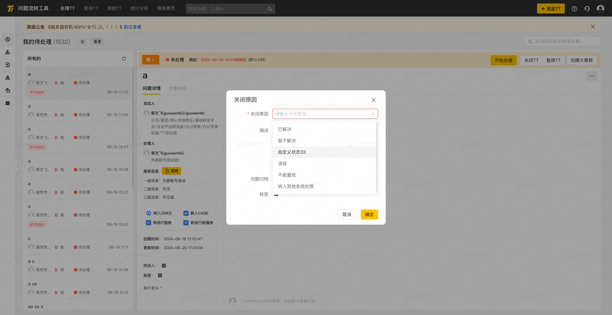
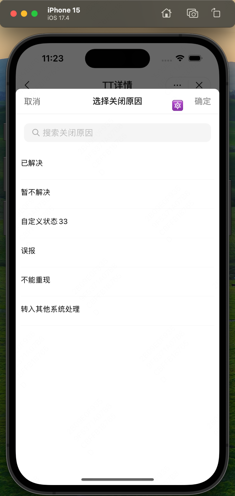
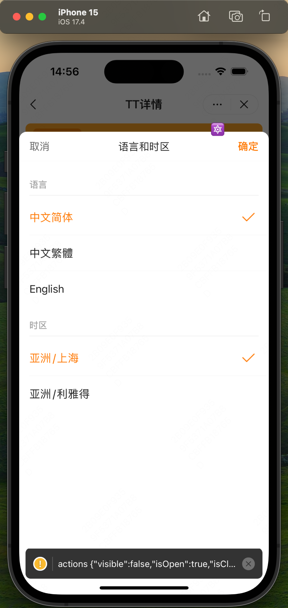
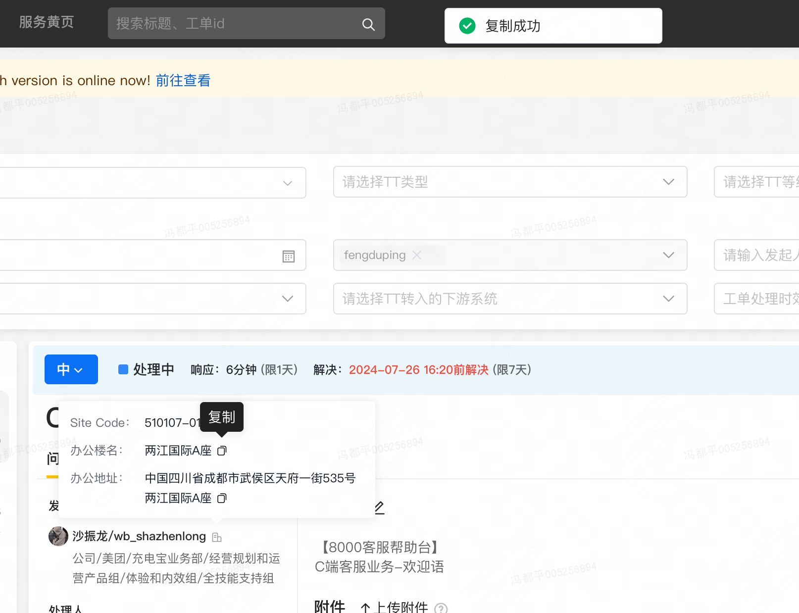

> 独立负责 TT 工单管理 web 端和移动端前端开发维护
> 负责的项目涉及 pc 端和移动端，每次需求都是两个端同时更改，pc 端是 vue2 的类写法，移动端是 react native 类写法
# 实现 TT 工单关闭原因支持无限滚动支持远程搜索
两个端共用一个接口
移动端使用 xcode 进行调试，有时候也用过真机，mrn 项目，m 指 meituan rn 就是 react native 项目
## pc 端

```js src/views/ticket/components/modals/close-ticket.vue
<template>
    <mtd-modal
        :title="$getText('close_ticket_dialog_title', '关闭原因')"
        class="handle-ticket-dialog form-dialog"
        :mask-closable="false"
        width="500px"
        @close="close"
        v-model="show">
        <mtd-form
            :model="formCustom"
            ref="formCustom"
            :label-width="120"
            :rules="ruleCustom"
            v-loading="!replyReady">
            <mtd-form-item
                class="require"
                prop="closedReason"
                required
                :label="$getText('close_ticket_dialog_closed_reason_label', '关闭原因')">
                <mtd-select
                    v-model="formCustom.closedReason"
                    style="width: 100%;"
                    :loading="reasonLoading"
                    :filterable="true"
                    :remote="true"
                    :remote-method="remoteMethod"
                    :debounce="500"
                    :placeholder="$getText('please_enter_the_reason_for_closure', '请输入关闭原因')">
                    <mtd-dropdown-menu
                        v-if="closeReason && closeReason.length > 0"
                        style="max-height: 224px;"
                        v-infinite-scroll="loadMoreCloseReasons"
                        :infinite-scroll-disabled="noMoreReasons"
                        :infinite-scroll-delay="500"
                        :infinite-scroll-distance="10"
                        :infinite-scroll-immediate="false">
                        <mtd-option
                            v-for="(item, index) in closeReason"
                            :key="index"
                            :label="item.label"
                            :value="item.value">
                            <text-highlight :queries="[query]">{{ item.label }}</text-highlight>
                        </mtd-option>
                    </mtd-dropdown-menu>
                </mtd-select>
            </mtd-form-item>
            <mtd-form-item prop="desc" :label="$getText('close_ticket_dialog_desc_label', '描述')">
                <editor
                    ref="editor"
                    v-if="replyReady"
                    :value="formCustom.desc"
                    :action="uploadApi"
                    :reply-list="replyList"
                    @input="handleChange"
                    @imgUpload="handleImgUpload"
                    @reply-quick="replyQuick">
                    <div slot="toolbar">
                        <slot name="toolbar" />
                    </div>
                </editor>
                <div
                    v-if="descOverflow"
                    class="overflow">{{ $getText('close_ticket_dialog_desc_overflow', '输入内容过长') }}</div>
            </mtd-form-item>
            <mtd-form-item
                class="archive-item"
                :class="{ 'mtd-form-item-required' : rgPermissionMap.archiveRequire }"
                :label="$getText('close_ticket_dialog_archive_label', '问题归档')"
                prop="archiveId">
                <ticket-file-select
                    :info="info"
                    @change="archiveChange"
                    :width="332" />
            </mtd-form-item>
            <mtd-form-item
                v-if="itemPermission('moseKnowledgeStore').editable && isShowResolution"
                prop="desc"
                :label="$getText('close_ticket_dialog_mose_knowledge_store_label', '沉淀摩西知识库')"
                :label-width="120">
                <linkage-dropdown
                    :rg-id="info.rgId"
                    ref="linkage"
                    @selectChange= "linkageChange" />
            </mtd-form-item>
            <mtd-form-item
                :class="{ 'mtd-form-item-required' : rgPermissionMap.labelRequired }"
                prop="labels"
                :label="$getText('close_ticket_dialog_labels_label', '标签')">
                <change-tag
                    :tag-list="info.labels"
                    :is-detail="true"
                    :rg-id="info.rgId"
                    @change="tagChange"
                    style="display: inline-block; margin-top: 2px;" />
            </mtd-form-item>
        </mtd-form>
        <div slot="footer">
            <mtd-button @click="close">{{ $getText('close_ticket_dialog_cancel_btn', '取消') }}</mtd-button>
            <mtd-button
                :loading="btnLoading"
                :disabled="imgUploadStatus || descOverflow"
                type="primary"
                @click="submit">{{ $getText('close_ticket_dialog_confirm_btn', '确定') }}</mtd-button>
        </div>
    </mtd-modal>
</template>

<script lang="ts">
import { Vue, Component, Prop, Watch } from 'vue-property-decorator';
import { Getter } from 'vuex-class';
import * as api from '../../../../api/index';
import editor from '@/components/quill-editor.vue';
import ChangeTag from '@/components/change-tag.vue';
import TicketFileSelect from '../ticket-file-select.vue';
import LinkageDropdown from '@/components/linkage-dropdown.vue';
import { itemPermission } from '@/utils/tools';
import { InfiniteScroll } from 'element-ui';
import TextHighlight from 'vue-text-highlight';

Vue.use(InfiniteScroll);

interface Form {
    desc: string;
    closedReason: string;
    archiveId: number;
    labels: [];
}
const validateReason: Function = (_rule, value, callback) => {
    if (!value) {
        return callback(new Error(Vue.prototype.$getText('error_close_reason_not_empty', '关闭原因不能为空')));
    }
    return callback();
};
/**
 * 关闭TT
 *
 * @author xiaokunyu
 * @date 01/22/2010
 */
@Component({
    components: {
        editor,
        TicketFileSelect,
        ChangeTag,
        LinkageDropdown,
        TextHighlight
    }
})
export default class CloseTicket extends Vue {
    @Getter loginType;
    @Getter misX;
    @Getter rgPermissionMap;

    @Prop({ default: '' })
    id: string;
    @Prop({ default: () => {
        return {};
    } })
    info: any;
    @Prop({ default: false }) editContent: boolean;

    replyList: string[] = [];
    replyReady: boolean = false;
    reasonLoading: Boolean = false;
    currentQuery: string = '';

    show: Boolean = true;

    ruleCustom = {
        closedReason: [
            { validator: validateReason, trigger: 'blur, change' }
        ],
        archiveId: [
            { validator: this.validateArchiveId, trigger: 'blur, change' }
        ],
        labels: [
            { validator: this.validateLabel, trigger: 'blur, change' }
        ]
    };
    formCustom: Form = {
        desc: '',
        closedReason: '',
        archiveId: 0,
        labels: []
    };
    btnLoading: Boolean = false;
    closeReason: {value: string, label: string}[] = [];
    $refs: any;

    imgUploadStatus: boolean = false;

    itemPermission: Function = itemPermission;
    isShowResolution: Boolean = false;
    linkageValue: Object = {
        domain: '',
        intention: '',
        linkageInvalid: false
    };

    // Infinite Scroll Variables
    pageNum: number = 1;
    pageSize: number = 20;
    totalReasons: number = 0;
    noMoreReasons: boolean = false;
    query: string = '';

    @Watch('info.rgId', { immediate: true })
    rgIdChange (rgId: number) {
        if (rgId) {
            this.formCustom.desc = this.editContent ? this.info.closedDesc : '';
            this.formCustom.closedReason = this.editContent ? this.info.closedReason : '';
            this.replyReady = false;
            // this.initCloseReason(rgId);
            this.getRgReplyText(rgId);
            this.loadMoreCloseReasons();
            this.resetLoadState();
        }
    }

    @Watch('info.archiveId', { immediate: true })
    archiveIdChange (archiveId) {
        if (!archiveId || archiveId !== '0') this.formCustom.archiveId = archiveId;
    }

    @Watch('info.labels', { immediate: true })
    async labelsChange (labels) {
        if (labels) {
            this.formCustom.labels = await this.getLabelIdsByNames(labels) || [];
        }
    }

    @Watch('formCustom.closedReason')
    onReasonChanged (val) {
        window.LXAnalytics && window.LXAnalytics('moduleClick', 'b_onecloud_cgywh7eq_mc', { custom: { reasion: val, mis: this.misX } });
    }

    async getLabelIdsByNames (tags) {
        const res: Ajax.AxiosResponse = await api.ticketApi.getLabelIdsByNames({
            labels: tags,
            mode: 'NAME_TO_ID'
        });
        return res.data.items;
    }
    replyQuick (value: string) {
        this.$set(this.formCustom, 'desc', value);
        this.handleChange(value);
    }

    @Watch('show')
    onShowChanged (val) {
        if (val) {
            this.resetLoadState();
        }
    }

    resetLoadState () {
        this.pageNum = 1;
        this.noMoreReasons = false;
        this.closeReason = [];
    }
    close () {
        this.show = false;
        this.$emit('close');
        // 重置分页和状态变量
        this.resetLoadState();
    }
    tagChange (val) {
        this.formCustom.labels = val;
    }
    archiveChange (val) {
        const { id } = val;
        this.formCustom.archiveId = id;
    }
    // async initCloseReason (rgId) {
    //     try {
    //         const res: Ajax.AxiosResponse = await api.ctiApi.getRgReplyField({
    //             rgId: rgId,
    //             type: 'CLOSED_REASON'
    //         });
    //         let { code, data } = res;
    //         if (code === 200) {
    //             this.closeReason = data.items.map(item => {
    //                 return {
    //                     value: item.content,
    //                     label: item.displayName || item.content
    //                 };
    //             });
    //         }
    //     } catch (e) {
    //         console.log(e);
    //     }
    // }
    async submit () {
        if (this.btnLoading) {
            return;
        }
        this.$refs['formCustom'].validate(async (valid) => {
            if (valid && !this.linkageValue.linkageInvalid) {
                this.btnLoading = true;
                let resObj = {
                    closedReason: this.formCustom.closedReason,
                    closedDesc: this.formCustom.desc,
                    labels: this.formCustom.labels
                };
                if (!this.editContent) resObj.state = '已关闭';
                if (this.formCustom.archiveId || (this.editContent && !this.formCustom.archiveId)) {
                    resObj = Object.assign(resObj, {
                        archiveId: this.formCustom.archiveId
                    });
                }
                try {
                    await api.ticketApi.updateTicket(this.id, resObj);
                    this.$mtd.message({
                        message: this.$getText('close_ticket_dialog_tip_closed', '此条问题已关闭'),
                        type: 'info'
                    });
                    this.$emit('success');
                    if (this.linkageValue.domain !== '' && this.linkageValue.intention !== '') {
                        this.$refs.linkage.addAnswerAndGrammar(this.formCustom.desc);
                    }
                    this.close();
                } catch (e) {
                    console.log(e);
                }
                this.btnLoading = false;
            }
        }).catch(err => console.log(`validate msg: `, err));
    }
    handleImgUpload (val) {
        this.imgUploadStatus = val;
    }
    handleChange (value) {
        this.formCustom.desc = value;
    }
    async getRgReplyText (rgId) {
        const res: Ajax.AxiosResponse = await api.ctiApi.getRgReplyText({
            rgId: rgId,
            type: 'CLOSED_DESC'
        });
        let { code, data } = res;
        if (code === 200) {
            this.replyList = data.items.map(item => item.content);
            this.replyReady = true;
        }
    }
    validateArchiveId (_rule, value, callback) {
        if (this.rgPermissionMap.archiveRequire && !value) {
            return callback(new Error(this.$getText('close_ticket_dialog_tip_no_archive', '问题归档不能为空')));
        }
        return callback();
    }
    validateLabel (_rule, value, callback) {
        if (this.rgPermissionMap.labelRequired && (!value || !value.length)) {
            return callback(new Error(this.$getText('close_ticket_dialog_no_tag', '标签不能为空')));
        }
        return callback();
    }
    get descOverflow () {
        return this.formCustom.desc?.length > 5000;
    }
    get uploadApi () {
        return this.loginType === 'PASSPORT' ? `/api/passport/tt/1.0/file/upload?ticketId=${this.ticketId}&area=comment` : `/api/tt/1.0/file/upload?ticketId=${this.ticketId}&area=comment`;
    }
    get ticketId () {
        return this.$route.query.id;
    }
    created () {
        console.log('1', this.noMoreReasons);
    }

    mounted () {
        this.getMosesSetting();
        this.$nextTick(() => {
            this.loadMoreCloseReasons();
            // this.getRgReplyText(this.info.rgId);
            console.log('Next tick, show:', this.show);
        });
    }
    async getMosesSetting () {
        try {
            const res = await api.ctiApi.getMosesSetting(this.info.rgId);
            const { code, data } = res;
            if (code === 200) {
                if (data.active) {
                    this.isShowResolution = data.resolutionKnowledgeBaseSwitch || false;
                }
            }
        } catch (e) {
            console.log(e);
        }
    }

    linkageChange (val: Object) {
        console.log('linkage', val);
        this.linkageValue = val;
    }

    // select远程搜索
    async remoteMethod (query) {
        this.reasonLoading = true;
        this.pageNum = 1;
        this.noMoreReasons = false;
        this.closeReason = [];
        this.currentQuery = query || '';
        await this.searchCloseReasons(this.currentQuery);
        this.reasonLoading = false;
    }

    // 滚动加载
    async loadMoreCloseReasons () {
        if (this.noMoreReasons) return;
        await this.searchCloseReasons(this.currentQuery);
    }

    // 查询关闭原因
    async searchCloseReasons (query) {
        this.query = query;
        try {
            const res = await api.ctiApi.getCloseReasonList({
                rgId: this.info.rgId,
                type: 'CLOSED_REASON',
                content: query,
                pageNum: this.pageNum,
                pageSize: this.pageSize
            });

            const { items, tn } = res.data;
            const mappedItems = items.map(item => ({
                value: item.content,
                label: item.displayName || item.content
            }));

            this.closeReason = [...this.closeReason, ...mappedItems];
            this.totalReasons = tn;
            this.pageNum += 1;

            if (this.closeReason.length >= tn) {
                this.noMoreReasons = true;
            }
        } catch (error) {
            console.error('Failed to load close reasons:', error);
        }
    }
}
</script>
<style lang="scss">
.handle-ticket-dialog {
    .archive-item {
        .recommend-archive-wrapper {
            margin-top: 14px;
            line-height: 18px;
        }
        .mtd-form-item-error-tip {
            position: absolute;
            top: 30px;
        }
    }
    .mtd-form-item-required.archive-item {
        margin-bottom: 16px;
    }
}
</style>
```

支持远程搜索主要是依靠后端接口，无线滚动也是边滚动边加载依靠接口，也就是分页查询
前端拿到输入框的 content 传给后端进行模糊查询，后端返回的字段有 tn（totalCount总共条目）、cn（currentCount当前页码）和 pn（pageCount每页记录数）
无线滚动借助的 element-ui 中的 InfiniteScroll api 实现的，里面封装好了，甚至有延迟，触发无线滚动的底部距离。搜索结果高亮是靠的 vue-text-highlight 库中的 TextHighlight 方法对搜索结果进行包裹即可
实现过程中碰到了第二次加载组件没有进行销毁的问题，体现在第二次进入该组件无法支持滚动加载，最终 使用了 v-if 刷新该组件的生命周期解决 `v-if="closeReason && closeReason.length > 0"`

pc 端还有个项目也需要改，tt 的后台设置界面单独成立了一个项目，这个设置界面是可以批量导入关闭原因，可以对列表顺序进行拖拽，文件上传用的是美团内部组件库 mtd-uploader 这个组件可以限制文件类型，还有声明周期，就是上传成功失败，前后，封装的很好
支持拖拽用的 vue-smooth-dnd 库中的 Container 和 Draggable 函数
```js src/views/rg/detail/components/reply-field-edit.vue
        <Container @drop="onDropEvent" drag-handle-selector=".icon-handle">
            <Draggable v-for="(replyItem, index) in relayContentList" :key="index">
                <div class="reply-item-wrapper">
                    <i class="iconfont icon-handle" />
                    {{ replyItem && replyItem.content }}
                    <div class="edit-buttons">
                        <i class="mtdicon mtdicon-edit-o" @click="editContent(replyItem)" />
                        <i class="mtdicon mtdicon-delete-o" @click="deleteContent(replyItem)" />
                    </div>
                </div>
            </Draggable>
        </Container>
```

拖拽完主要是一个顺序需要存储起来，这里自己封装了一个工具函数 用于处理拖拽操作后数组元素的位置变动
```js src/utils/helpers.js
export const applyDrag = (arr, dragResult) => {
    const { removedIndex, addedIndex, payload } = dragResult;
    if (removedIndex === null && addedIndex === null) return arr;

    const result = [...arr];
    let itemToAdd = payload;

    if (removedIndex !== null) {
        itemToAdd = result.splice(removedIndex, 1)[0];
    }

    if (addedIndex !== null) {
        result.splice(addedIndex, 0, itemToAdd);
    }

    return result;
};
```
它接收一个数组 arr 和一个包含拖拽结果的对象 dragResult，并返回一个新的数组，其中元素的位置已经根据拖拽操作进行了调整，每次拖拽都会产生一对元素下标的变动，移除的下标和新增的下标，以及元素payload，主要就是两边 splice 下再 add 进去就行

## 移动端

```js src/pages/tt/components/detail/CreateReason.tsx
import { i18nClient } from '@sailor/i18n-mrn'
/**
 * SLA 状态变化
 */

import React, { Component } from 'react'
import {
  Text,
  View,
  TouchableOpacity,
  Dimensions,
  StatusBar,
  Platform,
  ScrollView,
  ActivityIndicator,
} from '@mrn/react-native'
import { dStyle } from '../../constants/TTStyle'
import { TopViewManager, Toast, SlideModal, Tab, MTDProvider, Radio, Icon } from '@ss/mtd-react-native'
import { ttSlideModalProp } from '../common/TTHelper'
import theme from '@src/common/styles/MWSStyle'
import { MWSSearchList } from '@src/components/MWSSearchList'
import { ttTrackDetailClick, TTKeys } from '../../constants/TTKeys'
import { connectExternalUser, InjectedExternalUserProps } from '../../redux/connectors'
import SafeModalContainer from '@src/components/SafeModalContainer'
import { getCloseReasonList } from '../../constants/TTApi'
import { _searchHightColor } from '../common/SearchHightColor'

interface ReasonProps {
  title: string
  reasonList: string[]
  rgId: number
  onCancel: () => void
  onFinish: (selectedReason: string) => void
  // onSearch: (keyword: string) => void
}

interface IState {
  isSearching: boolean
  searchKeyWord: string
  title: string
  reasonList: string[]
  theme: {
    mtdBrandPrimary: string
  }
  selectedReason: { content: string } | null
  pageNum: number
  pageSize: number
  rgId: number
  totalItems: number
  currentPage: number
  isLoading: boolean
  noMore: boolean
  type: 'CLOSED_REASON' | 'PENDING_REASON';
}
export const modalMarginBottom = Platform.select({
  android: 24,
  ios: 0,
})

class _CreateReason extends Component<ReasonProps & InjectedExternalUserProps, IState> {
  // AssignModal 只有流转页使用，Assign只有发起页使用。
  // 组件内部自己维护数据流，通过callback进行组件间通信

  constructor(props: ReasonProps) {
    super(props)
    const title = this.props.title
    this.state = {
      isSearching: false,
      searchKeyWord: '',
      title: title,
      reasonList: this.props.reasonList,
      selectedReason: null as { content: string } | null,
      pageNum: 1,
      pageSize: 20,
      theme: {
        mtdBrandPrimary: '#FF7700',
      },
      rgId: this.props.rgId,
      totalItems: 0,
      currentPage: 1,
      isLoading: false,
      noMore: false,
      type: this.getReasonType(title), // 根据 title 初始化 type 状态
    }
  }

  async loadMoreReasons(rgId, query?: string) {
    if (!rgId || this.state.isLoading || this.state.noMore) return;

    this.setState({ isLoading: true });

    try {
      const res = await getCloseReasonList({
        rgId: parseInt(rgId, 10),
        type: this.state.type,
        content: query || '',
        pageNum: this.state.pageNum,
        pageSize: this.state.pageSize,
      });

      if (res?.code === 200 && res?.data) {
        const { items, tn, cn } = res.data;
        const newReasonList = items.map(item => ({
          label: item.displayName,
          content: item.content,
          value: item.id,
        }));

        this.setState(prevState => ({
          reasonList: prevState.pageNum === 1 ? newReasonList : prevState.reasonList.concat(newReasonList),
          totalItems: tn,
          currentPage: cn,
          pageNum: prevState.pageNum + 1,
          isLoading: false,
          noMore: newReasonList.length < prevState.pageSize,
        }));
      }
    } catch (e) {
      console.log('获取RG回复失败 ' + e);
      this.setState({ isLoading: false });
    }
  }

  getReasonType(title: string): 'CLOSED_REASON' | 'PENDING_REASON' {
    if (title === i18nClient.t('components_detail_9453fa', { defaultValue: '选择关闭原因' })) {
      return 'CLOSED_REASON';
    } else {
      return 'PENDING_REASON';
    }
  }

  componentDidMount() {
  }
  render() {
    return this.renderAssignbody()
  }
  handleModalClose = () => {
    this.props.onCancel()
  }

  renderAssignbody() {
    return (
      <SafeModalContainer style={{ marginBottom: modalMarginBottom }}>
        {this.renderTitle()} 
        <View style={dStyle.ticketDivider1} />
        {this.renderSearch()}
        {this.renderSelection()}
      </SafeModalContainer>
    )
  }

  renderTitle() {
    const { selectedReason } = this.state;
    const titleTxt = this.state.title
    const isDisabled = !selectedReason;
    return (
      <View style={dStyle.satisfyWrapper}>
        <TouchableOpacity
          style={dStyle.cancel}
          onPress={() => { this.props.onCancel() }}
        >
          <Text style={dStyle.FontRegul16}>{i18nClient.t('components_detail_625fb2', { defaultValue: '取消' })}</Text>
        </TouchableOpacity>
        <Text style={dStyle.FontBold16}>{titleTxt}</Text>
        <TouchableOpacity
          style={{ right: 0, position: 'absolute' }}
          onPress={() => this.handleFinish()}
          disabled={isDisabled}
        >
        <Text style={[dStyle.finishTxt, { color: isDisabled ? '#999' : '#FF8800' }]}>{i18nClient.t('components_home_38cf16', { defaultValue: '确定' })}</Text>
        </TouchableOpacity>
      </View>
    )
  }

  handleFinish() {
    const { selectedReason } = this.state;
    this.props.onFinish(selectedReason.content); // 将 selectedReason 传递给父组件的回调函数
  }

  renderSearch() {
    const getPlaceHolderText = (title: string) => {
        if (title === i18nClient.t('components_detail_9453fa', { defaultValue: '选择关闭原因' })) {
            return i18nClient.t('search_for_reason_for_closure', { defaultValue: '搜索关闭原因' });
        } else {
            return i18nClient.t('reason_for_search_pause', { defaultValue: '搜索暂停原因' });
        }
    };
    return (
      <MWSSearchList
        placeHolderTxt={getPlaceHolderText(this.state.title)}
        marginTop={18}
        marginBottom={0}
        styles={{
          color: theme.yellow800
        }}
        handleSearchOnFocus={() => {
          this.setState({ isSearching: true })
        }}
        handleSearch={keyWord => {
          console.log('keyword ' + keyWord)
          this.setState({
            searchKeyWord: keyWord,
            reasonList: [], // 清空当前的 reasonList
            pageNum: 1, // 重置分页信息
            noMore: false, // 重置 noMore 状态
            selectedReason: null
          }, () => {
            this.loadMoreReasons(this.state.rgId, keyWord);
          });
        }}
        handleCancelSearch={() => {
          this.setState({ isSearching: false, searchKeyWord: '' })
        }}
        handleClearChange={keyWord => {
          console.log('clear' + keyWord)
          // 清空搜索内容
          if (keyWord === '') {
            this.setState({ searchKeyWord: keyWord })
          }
        }}
      />
    )
  }

  isCloseToBottom({ layoutMeasurement, contentOffset, contentSize }) {
    return layoutMeasurement.height + contentOffset.y >= contentSize.height - 20;
  }
  

  renderSelection() {
    const { reasonList, selectedReason } = this.state
    return (
        <View style={{ flex: 1 }}>
          <ScrollView
            style={{ flex: 1 }}
            contentContainerStyle={{ flexGrow: 1 }} // 确保内容容器样式
            scrollEnabled={true}
            nestedScrollEnabled={true}
            onScroll={({ nativeEvent }) => {
              if (this.isCloseToBottom(nativeEvent)) {
                this.loadMoreReasons(this.state.rgId, this.state.searchKeyWord);
              }
            }}
            scrollEventThrottle={400}
          >
            <MTDProvider theme={this.state.theme}>
              <View style={{ backgroundColor: '#fff', paddingVertical: 6, width: '100%' }}>
                <Radio
                  checkedValue={selectedReason}
                  onChange={value => {
                    this.setState({ selectedReason: value });
                  }}
                  iconPosition="right"
                  style={{ padding: 10 }}
                >
                  {reasonList.map((reason, index) => (
                    <Radio.Item 
                      key={index} 
                      label={_searchHightColor(this.state.searchKeyWord, reason.content)}
                      hasLine 
                      value={reason} />
                  ))}
                </Radio>
              </View>
              {this.state.isLoading && (
                <View style={{ padding: 10, alignItems: 'center' }}>
                  <ActivityIndicator size="small" color={this.state.theme.mtdBrandPrimary} />
                  <Text style={{ color: '#999999' }}>
                    {i18nClient.t('base_components_772815', { defaultValue: '加载更多' })}
                  </Text>
                </View>
              )}
            </MTDProvider>
          </ScrollView>
        </View>
    )
  }
}

export const CreateReason = connectExternalUser(_CreateReason)

// 外部直接调用这个方法
export const openCreateReason = (props: ReasonProps) => {
  return SlideModal.open({
    useNativeDriver: true,
    visible: true,
    duration: 100,
    modalProps: ttSlideModalProp(props.onCancel),
    children: <CreateReason {...props} />,
  })
}
```

单独封装了一个组件 CreateReason，点击关闭原因弹出一个界面可以搜索关闭原因和下拉加载
这个组件用的 interface 参数有状态接口，包括搜索状态、关键词、标题、原因列表、主题、选中的原因、分页信息等
组件内部自己维护数据流，通过callback进行组件间通信
借助了 mrn 组件库中的 SlideModel 半页弹窗，父组件传过来的参数有 原因列表
```js 父组件
  openReasonSelection(title, reasonList) {
      const instance = openCreateReason({
        title,
        reasonList,
        rgId: parseInt(this.context?.ticketDetail?.rgId, 10),
        onCancel: () => {
          instance.close()
        },
        onFinish: (selectedReason) => {
          instance.close()
          this.handleReasonSelected(selectedReason, title)
        },
      })
  }
```

然后放到 render 中 this 去调用即可，实现的过程中总是 text 作为父容器进行包裹导致样式失效
这个 loadMoreReason 函数的触发条件是依靠 mrn 组件中的 ScrollView，有个 onScroll 方法在里面写一个函数即可
```js
  isCloseToBottom({ layoutMeasurement, contentOffset, contentSize }) {
    return layoutMeasurement.height + contentOffset.y >= contentSize.height - 20;
  }
```
另外，移动端的安卓和 ios 的 bottom 是不同的，ios 正常，android 需要再多一点 bottom 外边距
```js
export const modalMarginBottom = Platform.select({
  android: 24,
  ios: 0,
})
```
最后抛出再用 组件库 的 SlideModal 进行了一遍包裹
# TT 支持国际化
## pc 端
```js src/index.ts
// The Vue build version to load with the `import` command
// (runtime-only or standalone) has been set in webpack.base.conf with an alias.
import Vue from 'vue';
import App from './App.vue';
import router from './router';
import store from './store';
import * as filters from '@/utils/filters';
import { SSOGuard } from '@mtfe/sso-web';
import { isProd, isStaging } from './env';
import { lxanalyMethod } from '@/utils/directive/lxanaly';
import resources from '@/assets/locales/resources';
import { i18nPlugin } from '@sailor/i18n-vue';
import ChainedBackend from 'i18next-chained-backend';
import OpenAPIBackend from '@sailor/i18n-web-openapi-backend';
import resourcesToBackend from 'i18next-resources-to-backend';
import { setI18nClient } from './utils/axios';

// element-ui 的全局组件, 多语言, css 样式注入. 后续移除组件库一起移除
import './inject-element-ui';

// 全局注册埋点指令
Vue.directive('lxay', lxanalyMethod);
Vue.config.productionTip = false;
// 注册全局过滤器
Object.keys(filters).forEach(key => {
    Vue.filter(key, filters[key]);
});

Vue.use(i18nPlugin, (i18nClient) => {
    i18nClient.use(ChainedBackend).init({
        fallbackLng: 'zh',
        lng: 'zh',
        ns: 'tt_fe',
        defaultNS: 'tt_fe',
        backend: {
            backends: [
                OpenAPIBackend,
                resourcesToBackend(resources)
            ],
            backendOptions: [
                {
                    namespaces: [{
                        name: 'tt_fe',
                        projectId: 23,
                        apiKey: '5bf27684785a4a219c2bdfbcfdcc9027',
                        namespaceId: 'z5a0x0qnmk'
                    }],
                    env: isProd ? 'prod' : 'test'
                }
            ]
        }
    }, () => {
        setI18nClient(i18nClient);
        console.log('初始化成功');
    });
});
// $getText('key');
// const getNs2Text = this.$i18nClient.getFixedT(null, "tt_fe");

// export default getNs2Text

let vue = new Vue({
    el: '#app',
    router,
    store,
    render: h => h(App),
    components: { App }
});

const ssoGuard = (isProd || isStaging) ? new SSOGuard({
    clientId: '9504f696cb',
    accessEnv: 'product',
    appkey: 'com.sankuai.tt.core.fe',
    h5GuardOptions: {
        domains: ['tt.fetc.st.sankuai.com', 'tt.sankuai.com'],
        xhrHook: true,
        fetchHook: true
    }
}) : new SSOGuard({
    clientId: 'cc7fabacff',
    accessEnv: 'test',
    appkey: 'com.sankuai.tt.core.fe',
    h5GuardOptions: {
        domains: ['dev-tt.cloud.test.sankuai.com', 'tt.cloud.test.sankuai.com'],
        xhrHook: true,
        fetchHook: true
    },
    isDebug: true
});
// ssoGuard.init();

Vue.config.errorHandler = (error, vm, info) => {
    window.owl && window.owl(
        'addError',
        error,
        {
            level: window.Owl.errorModel.LEVEL.ERROR,
            combo: true,
            tags: {
                userInfo: store.getters.misX,
                content: error.message,
                component: vm.$options.name,
                info: info
            }
        }
    );
    console.warn('VUE ERROR', error, vm, info);
};

```

在项目的人口文件 index.ts 中去使用i18nPlugin插件进行国际化配置，使用ChainedBackend和OpenAPIBackend作为后端，加载本地资源resources。
初始化国际化客户端，并设置默认语言和命名空间。

然后项目的 assets 会有个 locale 存放那些语言包，然后在 vue 文件中正常使用：`${$getText('create_category_form_assign', '指派')}`
然后选择一个首页文件在 created 中，调用拿到用户语言时区数据
```js src/components/topnav.vue
    async handleLanguage () {
        let newLanguage = '';
        let newTimeZone = '';
        try {
            // 获取用户时区，提前设置时区信息
            const res = await api.preferenceApi.getUserLanguage();
            const { code, data } = res;
            if (code === 200 && data) {
                newLanguage = data.locale || '';
                newTimeZone = data.timeZone || '';
            }
        } catch (error) {
            console.error('Get language setting error', error);
        }
        // 用户没有设置过语言，则使用浏览器语言
        if (!newLanguage) {
            const userLang = navigator.language || navigator.userLanguage;
            if (userLang) {
                const enLangRegex = /^en(-[a-zA-Z]+)?$/;
                // const zhLangRegex = /^zh(-[a-zA-Z]+)?$/;
                // const simplify = ['zh-CN', 'zh-SG', "zh"];
                if (enLangRegex.test(userLang)) {
                    newLanguage = 'en';
                } else if (userLang === 'zh-HK') {
                    newLanguage = 'zh-HK';
                } else {
                    newLanguage = 'zh';
                }
            }
        }
        // 如果语言和默认语言不一致则替换语言
        if (newLanguage && newLanguage !== this.language) {
            this.$i18nClient.changeLanguage(newLanguage, (err) => {
                if (err) {
                    this.$mtd.message.error(this.$getText('change_language_failed', '语言切换失败'));
                    return;
                }
                this.setLanguage(newLanguage);
            });
        }
        changeLanguageForElement(newLanguage);

        if (newTimeZone && newTimeZone !== this.timeZone) {
            // this.setLanguage(newLanguage);
            this.setTimeZone(newTimeZone);
        }
    }
```

没有数据就获取浏览器语言 `navigator.language`
## 移动端
入口文件初始化
```js
initOwl('rn_bfe_tt')
i18nClient.init({
  lng: 'zh',
  resources,
  interpolation: {
    escapeValue: false // react 不需要这个
  },
  react: {
    useSuspense: false
  }
})
```

并且单独封装了个高阶组件：接受其他组件作为参数
```js src/pages/tt/components/withUserInfo.tsx
import React from 'react'
import { connect } from 'react-redux';
import {
  connectExternalUser,
  InjectedExternalUserProps
} from '../redux/connectors'
import { Dispatch } from 'redux';
import { getUserLanguage, getTimeZoneOptions } from '../constants/TTApi';
import { i18nClient } from '@sailor/i18n-mrn';
import KNB from '@mrn/mrn-knb'
import { RootState } from '../redux/store';
import { setTimeZone } from '../redux/actions';
import { dispatchSetTimeZone } from '../redux/thunks';


const mapDispatchToProps = (dispatch) => ({
  dispatchSetTimeZone: (timeZone) => dispatch(setTimeZone(timeZone)),
});

import { customInfo } from '@src/common/helpers/customError';

export function withUserInfo<P extends { [key: string]: any }>(
  WrappedComponent: React.ComponentType<P>
) {
  return connectExternalUser(
    connect(null, mapDispatchToProps)(

    class extends React.Component<P & InjectedExternalUserProps> {
      constructor(props) {
        super(props);
        // 获取语言信息并set
        customInfo('页面打开')
      }

      async init() {
        let lang = 'zh'
        // 优先获取大象语言设置
        // const dx_la = await this.getLang()
        // console.log('==== dx_la ====', dx_la)
        // const validLang = ['zh', 'en', 'zh-HK']
        // if (dx_la && validLang.indexOf(dx_la) >= 0) {
        //   lang = dx_la
        // } else {
        // 大象语言不支持，则获取tt语言
        const res = await getUserLanguage()
        const tt_la = res?.data?.locale
        if (tt_la) lang = tt_la
        // }
        // 设置当前时区
        const selectedTimeZone = res?.data?.timeZone || 'GMT+08:00'; // 默认时区
        this.props.dispatchSetTimeZone(selectedTimeZone);

        i18nClient.changeLanguage(lang, (err, t) => {
          console.log('语言设置成功', lang)
          if (err) {
            console.error("语言切换失败");
            return
          }
        })
        const ops = await getTimeZoneOptions()
        // this.props.dispatchFetchTimeZoneOptions(ops?.data);
      }

      getLang = async (): Promise<string> =>
        new Promise((resolve, reject) => {
          KNB.use('getAppInfo', {
            success: res => {
              console.log(res, '------resfee----')
              resolve(res?.extras?.dx_la)
            },
            fail: err => {
              reject(err)
            }
          })
        })

      async componentDidMount() {
        this.init()
        this.props.dispatchFetchUserInfo()
      }

      render() {
        return <WrappedComponent {...this.props} />
      }
    }
  )
)
}
```
移动端的 TT 相当于是大象应用的小程序，因此没有语言数据会通过 KNB 桥去拿到大象的语言数据

然后其他组件抛出时会被包裹一层
```js
export default withTranslation('', {
	withRef: true
})(Home);
```
正常组件去使用中英文就是调用 T 函数：`{i18nClient.t('components_custom_38cf16', { defaultValue: '确定' })}`

# 移动端支持语言时区实时切换


开始用的 dayjs ，因为包体积小点，后面发现安卓没有 INTL 这个 api 会报错，用 moment 就没这个问题，这个包大概 100 多 kb，dayjs 就是 10 来 kb
封装了一个工具函数：
```js src/common/helpers/moment.ts
import moment from 'moment-timezone';
import store from '../../pages/tt/redux/store';

const defaultTimeZoneList = new Map([
    ['GMT+08:00', 'Asia/Shanghai'],
    ['GMT+03:00', 'Asia/Riyadh'],
]);

const momentWithTimeZone = (...args) => {
    const { timeZone } = store.getState();
    const { timeZone: selectedTimeZone, timeZoneList } = timeZone || {};

    const options = timeZoneList || defaultTimeZoneList;
    const currentTimeZone = options.get(selectedTimeZone) || 'Asia/Shanghai';

    return moment.tz(...args, currentTimeZone);
};

export default momentWithTimeZone;
```
这个库支持我们去改变时区，然后工具函数中的时间相关函数都用这个函数进行包裹一下
比如
```js
export function formatDate(timestamp: number, format: string = 'YYYY/MM/DD HH:mm') {
  if (!timestamp) {
    return '';
  }
  return dayjsWithTimeZone(timestamp).format(format);
}
```
redux 库中在 action 中初始化好时区数据
```js
export const SET_TIME_ZONE = 'SET_TIME_ZONE';
export const SET_TIME_ZONE_LIST = 'SET_TIME_ZONE_LIST';

export const setTimeZone = (timeZone) => ({
  type: SET_TIME_ZONE,
  payload: timeZone,
});

export const setTimeZoneList = (timeZoneList) => ({
  type: SET_TIME_ZONE_LIST,
  payload: timeZoneList,
});
```
然后 reducer 中写函数
```js
const initialState = {
  timeZone: 'Asia/Shanghai',  // 默认时区
  timeZoneList: new Map([
      ['GMT+08:00', 'Asia/Shanghai'],
      ['GMT+03:00', 'Asia/Riyadh'],
  ]),
};

const timeZoneReducer = (state = initialState, action) => {
  switch (action.type) {
      case SET_TIME_ZONE:
          return {
              ...state,
              timeZone: action.payload,
          };
      case SET_TIME_ZONE_LIST:
          return {
              ...state,
              timeZoneList: action.payload,
          };
      default:
          return state;
  }
};

export default combineReducers({
  dxAuth: commonReducer,
  ttHomeReducer: templateReducer,
  ttDetailReducer: templateDetailReducer,
  userInfo: userInfoReducer,
  timeZone: timeZoneReducer
})
```
thunks 中 派发更新
```js
export const dispatchSetTimeZone = (selectedTimeZone) => async (dispatch) => {
  dispatch(setTimeZone(selectedTimeZone));
};
```
实现过程中会有很多细小的 bug，没有及时更新视图，后面发现有的文案不是 用 t 函数，而是什么 default，给他加一个 key 就好


# TT 支持自定义状态
## pc端
这里用的 自定义状态需要及时更新，我用的 eventBus 派发更新，因为可以切换 rg 组，切换完后没有更新相应 rg 组的状态
我在按钮那个组件页的点击时间中去派发更新，并且把相应的数据送过去
```js
import eventBus from '@/utils/event-bus';

// 触发事件通知其他组件
eventBus.$emit('ticket-updated', this.catagorys);
```
在状态组件中 的 mounted 中 监听事件总线：
```js
eventBus.$on('ticket-updated', this.handleTicketUpdated);
```
然后在 beforeDestroy 钩子中 去销毁监听
```js
eventBus.$off('ticket-updated', this.handleTicketUpdated);
```

移动端没啥好说的
# site 数据调用
## pc 端

site 数据调用有个复制功能，vue 里面有个指令 v-clipboard 可以复制到粘贴板
```js

```
## 移动端
site 数据放到一个半页弹窗 SlideModal 中
像是这种半页弹窗为了匹配不同机型，最好控制高度用 `Dimensions.get('window').width`
然后就是这里的粘贴
```js
<TouchableOpacity onPress={() => {
    Clipboard.setString(value.toString())
    Toast.open(i18nClient.t('base_components_20a495', { defaultValue: '复制成功' }))
}}>
```


# TT 工单支持暂停时间选择
> 佳明实现的需求
## pc 端
使用 deep 样式
```js
/deep/ .mtd-input {
    border-top-left-radius: 0;
    border-bottom-left-radius: 0;
}
```

## 移动端

# MyKeeta 入口改造，需要支持移动端适配
> 佳明实现的需求
```js
@media (max-width: 670px) {
    .dx-ticket-create {
        .create-form {
            .vertical-line-container {
                display: inline-block;
            }
        }
        .create-content {
            padding: 20px 10px;
            height: calc(100% - 60px);
            overflow: auto;
        }
    }
}

@media (max-width: 635px) {
    .dx-ticket-create {
        .create-form {
            .vertical-line-container {
                display: block;
            }
            .level-tip {
                margin: -25px 0 10px 60px;
                position: static;
                .triangle {
                    margin: 10px 0 0 10px;
                    width: 0;
                    height: 0;
                    border: 5px solid transparent;
                    border-bottom: 5px solid #eef6ff;
                }
                .tip-wrapper {
                    display: block;
                    max-width: 285px;
                    padding: 4px 8px;
                    font-size: 12px;
                    color: rgba(0, 0, 0, 0.38);
                    line-height: 18px;
                    background: #f7f8fa;
                    border-radius: 2px;
                }
                &.tip-S1 {
                    .triangle {
                        border-bottom-color: #ffe9e6;
                        border-right-color: #fff;
                    }
                }
                &.tip-S2 {
                    top: 0;
                    .triangle {
                        border-bottom-color: #fff2e2 !important;
                        border-right-color: #fff;
                    }
                }
                &.tip-S3 {
                    .triangle {
                        border-bottom-color: #fff9e2 !important;
                        border-right-color: #fff;
                    }
                }
                &.tip-S4 {
                    top: 0;
                    .triangle {
                        border-bottom-color: #eef5ff !important;
                        border-right-color: #fff;
                    }
                }
                &.tip-S5 {
                    .triangle {
                        border-bottom-color: #ededed !important;
                        border-right-color: #fff;
                    }
                }
            }
        }
        .create-content {
            padding: 20px 10px;
            height: calc(100% - 60px);
            overflow: auto;
        }
    }
}

@media (max-width: 450px) {
    .dx-ticket-create {
        .set-default-catalog {
            display: none;
        }
        .set-default-catalog-450 {
            display: block;
            float: right;
        }
    }
    .mtd-modal {
        min-width: 300px !important;
    }
}
```

主要是 媒体适配，看了 pr，好像有很多坑，重写了很多页面

# 总结
这几个需求出现了好几次 bug 是因为长的链式调用没有用 ？可选操作符导致报错，还有就是没有做技术方案，比如 dayjs 不适用于 安卓 机型。还有些问题是异步导致的，接口顺序很重要
还有就是有时候没有严格遵守 ui 稿